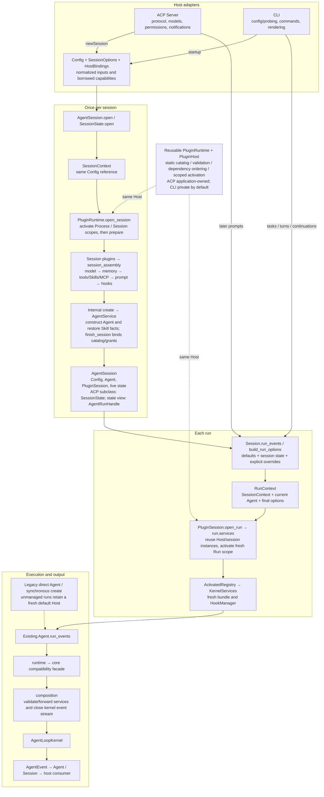

# Agent Session and Plugin Lifecycle

`AgentSession.open(config=...)` is the managed entry point used by ACP and CLI.
It retains the caller's Config, prepares configured capabilities once, creates
the Agent, and owns session cleanup. Each `run_events()` creates a fresh run
activation from that session's existing runtime. `SessionLog` remains the only
durable session-state source.

## Creation and execution



The arrows show lifecycle and call flow. The kernel does not import the session,
Config, PluginHost, or adapters. It receives resolved values and services.
Managed composition does not create a second default Host or dispose resources
owned by the session. It still owns closing the kernel event stream.

## Inputs and configuration timing

| Input | Meaning |
| --- | --- |
| `Config` | Existing configuration object, retained by reference through SessionContext and RunContext |
| `SessionOptions` | Stable workspace cwd, execution/session mode, utility flag, permission policy and session state |
| `HostBindings` | Borrowed model clients, application tool catalog, SkillLoader, memory, hooks, SessionLog, discovery tasks and host callbacks |
| Skill Engine | Optional `skill_runtime` is forwarded to Agent; otherwise its loader is resolved from the final prepared Skill tools. |
| `PluginRuntime` | Optional application-owned runtime shared across sessions; `open` creates a private runtime when omitted |

Constructor settings keep their existing read timing. Step limits, tool limits,
context budget and retry settings resolve when the Agent is constructed.
Existing turn policy continues to read the same Config at turn time. Model
switches and explicit run overrides resolve before the run service bundle is
built. Replacing an adapter's default Config affects future sessions only.
This is not a hot-reload API.

`session_assembly.py` calls the existing capability producers, retaining
ACP/CLI prompt segment ordering, raw tool schemas and ordering, Skill selection
and restoration, memory gates, utility suppression, and deferred MCP timing.
The static initializer list always exists; existing Config gates inside those
initializers decide which resources to prepare. There is no new `plugins`
configuration key or plugin-directory scanning.

## Scope and ownership

| Scope | Ownership and disposal |
| --- | --- |
| Process | One PluginRuntime/Host and explicit process plugins. Process factories receive application context (currently `None`), never a session Config. ACP's existing model pool and discovery resources remain borrowed host capabilities. |
| Session | Config-dependent built-in resources, prompt, tools and Skill state. Created once, isolated by session key, reused across turns. Only resources created by assembly are registered for cleanup. |
| Run | Fresh RunContext, HookManager and KernelServices bound to current options. Activation ends on completion, error, cancellation or early stream closure. |

Descriptors accept either the original no-argument `factory` or
`context_factory(PluginFactoryContext)`. The latter receives its exact scope
context and a read-only mapping of declared dependency IDs to instances.
Dependencies cannot reference a shorter-lived scope. Validation and dependency
ordering precede activation; asynchronous preparation runs outside Host
lifecycle reservations.

Closing a session stops its active run before releasing session resources.
Closing a shared runtime waits for in-flight initialization, closes all sessions,
then closes process resources. Initialization failures roll back; callbacks
interrupted by cancellation remain available for a subsequent `aclose()`.
Ordinary disposer failures are terminal, following PluginHost's existing
semantics. The primary execution error is preserved when cleanup also fails.
Duplicate active session keys and overlapping runs are rejected.

Borrowed clients, catalogs, discovery tasks and SessionLog are closed by their
existing owners. `LLMClient.aclose()` closes its SDK transport; `for_model()`
views sharing that transport must not close it independently.

`AgentSession.create(skill_runtime=...)` forwards the supplied instance to Agent;
it does not create a second set of Skill read or recovery records. The similarly
named `skill_runtime_context` describes the Python/Node execution environment.
CLI and ACP share the session's explicit Skill allowance set with directory and
reading tools. Legacy `preloaded_*` fields describe actual delivery, not selection,
current body visibility, or permission. The final run composition binds Context
to the session's SkillRuntime and SessionLog while preserving managed capabilities.

## Managed Python use

```python
from contextlib import aclosing

from box_agent.agent_session import AgentSession
from box_agent.session_context import SessionOptions

session = await AgentSession.open(
    config=config,
    options=SessionOptions(workspace_dir=workspace),
)
try:
    session.agent.add_user_message(user_text)
    async with aclosing(session.run_events()) as events:
        async for event in events:
            await render(event)
finally:
    await session.aclose()
```

Pass `runtime=shared_runtime` to reuse one Host across multiple sessions, and
close that runtime at application shutdown. Pass `HostBindings` to borrow
already-probed models or other host-owned capabilities. A binding containing
both `tools` and `system_prompt` opts into the prepared-resource contract.

`AgentSession.create(config=..., llm_client=..., system_prompt=..., tools=...)`
remains synchronous and backward compatible. It constructs a session from
prepared resources without managed plugin ownership. Direct `Agent`,
`AgentSession(agent=...)` and `SessionState(agent=...)` remain supported.
Their runs retain the default per-run Host path. Use `session.run_events()`
to run a managed session; direct calls to its Agent bypass managed run ownership.

`AgentRunHandle` remains a view of the same session state. `build_run_options`
binds cancellation, injection and summary/extraction references before explicit
overrides. Managed sessions populate the internal `kernel_services` field;
adapters should not supply it themselves.

New protocol-neutral runs are available through `AgentService.start(RunRequest,
session=...)`. The returned `AgentRunHandle` starts the compatible session run,
exposes ordered `EventEnvelope` values from `events()`, accepts `cancel`,
`pause`, `resume`, `inject_message`, and `permission_response` commands through
`send()`, and returns one aggregated `RunResult` from `result()`. `pause` takes
effect at the next kernel checkpoint; a `PermissionBroker` correlates
`PermissionRequestEvent.request_id` with `permission_response`. `AgentSession.run_events()` remains the compatibility
stream for existing adapters during migration.

For a continuation over messages that an adapter has already staged, set
`RunRequest.user_message` to `None`; the service reuses the current Session
history without appending another user message.

The Python SDK exposes the same boundary through `AgentClient(session)`. Use
`await client.run(request)` for a non-rendering run, or
`await client.start(request)` when the caller needs the handle's event stream
and control methods. The SDK does not own Session construction or cleanup.

## Adapter boundaries

ACP retains request parsing, workspace/model binding, permission reverse RPC,
task registration, initial goals, turn orchestration and event rendering.
`SessionState` inherits the common session and extends it with ACP metadata.
Rebinding closes the old session after workspace validation; failed restoration
releases the unpublished session. Server shutdown closes sessions, background
tasks, owned models and tool runtime resources.

If a Run activation fails and its rollback is interrupted, PluginHost retains
the unfinished Run resources under that session key, including resources that
failed runtime Port validation. The session cannot activate another Run until
cleanup finishes. Closing it retries those Run resources before releasing its
Session dependencies; a second interruption leaves the session retryable and
does not affect other sessions or Process resources.

CLI retains configuration setup/probing, terminal input, commands and rendering.
One managed session serves task mode, interactive turns and goal continuations.
`/clear` and `/clear_all` reuse that session. The CLI closes its session and every
model client it created, including probe/reconfiguration clients, on exit.

### Durable CLI sessions

CLI invocations create a SessionLog and print its logical ID. Pass
`--session-id <id>` or `--resume <id>` to reopen it in the same workspace. The
Agent, run options and diagnostic trace share that ID. A workspace mismatch is
rejected, and a failed opening releases the log writer lock. The CLI closes its
borrowed log after managed session cleanup, including failed startup paths.

```bash
box-agent --session-id report-work --task "Inspect the report inputs"
box-agent --resume report-work --task "Continue from the saved history"
box-agent goal status --session-id report-work
box-agent goal progress "Inputs checked" --session-id report-work
```

`SessionLog.open_or_create(..., prepare_resume=False)` lets shared session
preparation validate current Skill sources before repairing interrupted calls.
`SessionOptions.resume_session_log` enables this ordering. CLI restores strictly;
ACP retains its existing partial restoration policy for optional Skill state.

Named sessions use their log's goal even when it is empty; an unrelated workspace
goal never overwrites it. For compatibility, fresh unnamed CLI sessions can seed
and mirror the legacy workspace goal file. The goal command without a session ID
retains that legacy target, while the named form shares the existing complete
action and output policy with SessionLog persistence.

Clearing history commits a required `surface/reset` event before clearing live
messages. It retains goal/plan/todo/Skill facts and the append-only audit trail.
Reset affects both surface reducers so later appends and compression cannot
revive cleared messages. Older readers that do not understand this event reject
the log; recovery-enabled hosts may archive it and start a replacement. Before
rolling back a runtime that has written resets, retain a reader with reset
support. Marking reset ignorable would incorrectly restore cleared history.

Skill names and descriptions may enter the system catalog. Context assembles
main-Agent Skill bodies into ordinary request material, or a reading tool returns
them as tool content. Restore validation precedes SessionLog resume repair, and
the session preserves Agent's retry and request-commit boundaries. Connector
catalog and read permissions remain separate session gates; required dependencies
and delegated reads obey those gates too.

Skill content loading, matching and MCP discovery retain their existing lazy or
deferred behavior. Moving preparation to session plugins does not eagerly load
every Skill body or connect every MCP server at session start. Host callbacks
and product workflows stay in their owning adapters/capability modules.

## Verification

`test_session_plugins.py`, `test_plugin_runtime_lifecycle.py`,
`test_plugin_host_context.py` and `test_managed_kernel_services.py` cover scoped
reuse, configuration identity, fresh run bindings, failure rollback,
cancellation, consumer closure and compatibility. `test_session_adapter_assembly.py`
checks shared ACP/CLI preparation, ordinary/project/utility prompt and raw tool
schema contracts, restoration failure and ownership. Existing Agent, ACP, CLI,
Skill, prompt and architecture suites remain relevant.

Source tests and ACP source-process probes do not prove packaged host behavior.
A runtime build/install, host restart and fresh live task are separate validation
boundaries.
