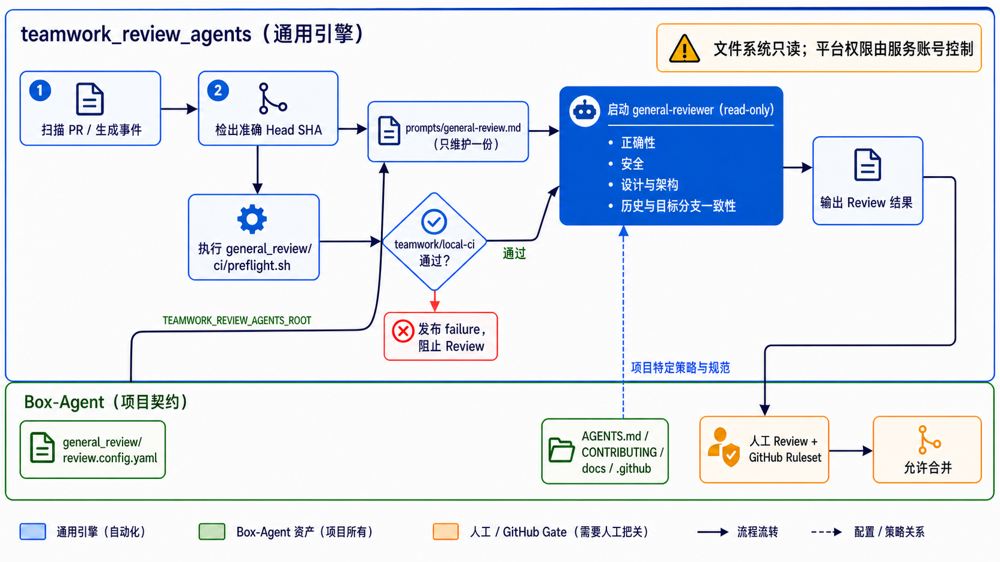

# Box-Agent 自动化 Review 接入

## 1. 所有权边界

`teamwork_review_agents` 是通用 Review 引擎，负责 GitHub/GitLab 扫描、快照与
事件、Preflight 执行、Commit Status、规则匹配、Agent 编排、资源锁、
日志和幂等控制，并维护可复用的通用 Review Prompt。它不得包含 Box-Agent 的测试
命令、项目路径、架构规则或业务专属 Prompt。

Box-Agent 在 `general_review/` 中版本化维护自己的接入契约：

- `review.config.yaml`：仓库、Preflight、Review 角色和触发规则；
- `ci/preflight.sh`：本地 CI 的唯一命令入口；
- `AGENTS.md`、`CONTRIBUTING*.md` 和 `docs/`：Box-Agent 的具体 Review 规则。

通用正确性、安全、设计、历史/目标分支一致性审核统一由
`teamwork_review_agents/prompts/general-review.md` 定义。Box-Agent 不复制该文件，
而由 `review.config.yaml` 通过 `TEAMWORK_REVIEW_AGENTS_ROOT` 原样引用。

Secret、SQLite、PID、日志和临时状态不进入 Git。运行状态写入被忽略的
`general_review/runtime/`。



## 2. 门禁顺序

1. **G0 — PR 元数据**：PR 使用 `.github/pull_request_template.md` 完成 TPR、
   设计影响和目标分支一致性说明。
2. **G1 — Box-Agent CI**：通用引擎在准确 PR Head 的 detached worktree 中执行
   `general_review/ci/preflight.sh`，并发布 `teamwork/local-ci` Commit Status。
3. **G2 — 单 Agent Review**：只有 G1 成功才启动只读 `general-reviewer`；同一
   Prompt 完成正确性、安全、设计、历史和目标分支一致性审核。
4. **G3 — 人工维护者**：验证 P0/P1/P2、Proof、Owner 和残余风险。
5. **G4 — GitHub Ruleset**：required checks 和 required reviews 全部满足后才能
   合并。

Head SHA 变化后，旧的 CI 和 Review 结论不得复用。

## 3. CI 契约

Teamwork 本地 Preflight 调用仓库唯一的 CI 入口：

```bash
bash general_review/ci/preflight.sh
```

脚本顺序固定为：

```text
uv sync --frozen --all-extras
uv run python -m compileall -q box_agent
uv run pytest tests/ -q --tb=short --deselect <已记录的网络超时用例>
uv build
```

触发规则必须设置 `run_preflight: true`。首个失败步骤终止后续步骤，CI 失败或超时
不会启动该规则的 `general-reviewer`。当前执行模型只允许可信内部 PR；临时
worktree 和环境过滤不是容器、独立 UID 或虚拟机级安全边界。

## 4. Review 角色

| 角色 | 运行策略 | 职责 |
| --- | --- | --- |
| `general-reviewer` | 每次完整 Review | 验证完整 diff、正确性、安全、架构层、历史修复意图、目标分支一致性与 runtime 证据 |

该角色使用 `read-only`、空 `write_scopes` 和空 `allowed_sub_agents`。其中
`read-only` 约束本地文件系统；`write_scopes` 是调度锁声明，不等同于平台授权。
现有通用 Prompt 包含评论和门禁满足后的自动合并流程：若部署要求人工最终合并，
运行 Agent 的 WSL 服务账号不得配置具有评论/合并权限的 `gh`/`glab` 凭据。

## 5. 启动

Preflight 必须在 WSL/Linux 服务账号中运行，并使用该环境内安装、认证的 Git、uv
和 Codex CLI：

```bash
# 这些路径必须来自 WSL/Linux；若指向 /mnt/c，先安装 WSL 原生 Node/npm。
command -v git uv node npm codex
npm install -g @openai/codex
codex --version
codex --login

python3 -m venv "$HOME/.venvs/teamwork-review-agents"
"$HOME/.venvs/teamwork-review-agents/bin/pip" install \
  -e /mnt/d/code/teamwork_review_agents

cd /mnt/d/code/teamwork_review_agents
export GITHUB_TOKEN='<provider token from a secret store>'
export CODEX_HOME="$HOME/.codex"
export TEAMWORK_REVIEW_AGENTS_ROOT='/mnt/d/code/teamwork_review_agents'

"$HOME/.venvs/teamwork-review-agents/bin/teamwork-review-agents" validate \
  -c /mnt/d/code/Box-Agent/general_review/review.config.yaml

"$HOME/.venvs/teamwork-review-agents/bin/teamwork-review-agents" run \
  -c /mnt/d/code/Box-Agent/general_review/review.config.yaml
```

本机管理界面为 `http://127.0.0.1:8080/`。GitHub Fine-grained Token 至少需要读取
PR 和 Commit Status、写入 Commit Status 的仓库权限；Provider Token 不进入 Codex
进程。

`TEAMWORK_REVIEW_AGENTS_ROOT` 必须传给 `validate`、`run`、`start`、`restart` 和
`stop` 使用的服务环境；缺失时配置中的通用 Prompt 路径无法解析。正式部署时可将
它指向稳定安装目录，而不是示例中的开发 worktree。

不要复用 `/mnt/c/Users/.../npm/` 下的 Windows Codex shim。当前机器的该 shim 会因
缺少 `@openai/codex-linux-x64` 而启动失败；应在 WSL 原生 Node/npm 环境中安装并
认证 Codex，再启动 Review 服务。

## 6. GitHub 配置

针对 `main` 的 Ruleset 至少要求：

- `teamwork/local-ci`；
- 仓库规定的人工 Review 数量。

本仓库不再维护 GitHub Actions CI；确定性检查统一由 Teamwork Preflight 在准确
PR Head 的隔离 worktree 中运行。

`.github/CODEOWNERS` 应由仓库管理员使用真实 GitHub Team/User 映射补充。不要猜测
不存在的 Team slug；在映射落地前，`docs/ARCHITECTURE*.md` 中的所有权规则仍是
Review Agent 的架构依据。

## 7. 当前能力边界

- 当前通用快照没有把 PR 正文/TPR 注入 Agent Prompt。缺少正文时 Reviewer 必须
  标记 `TPR: not provided by runtime`，不得推断其完整性。
- Agent 最终消息保存在 SQLite/UI，不会自动发布 GitHub Review。
- 若要自动核验 TPR 和发布 Review，应在通用引擎增加脱敏 PR 上下文和窄权限发布
  接口，不应把高权限 Provider Token 直接交给 Codex。
- `.understand-anything` 图谱只用于定位；它落后时必须说明，并以当前源码、Git
  历史、测试和探针验证结论。
