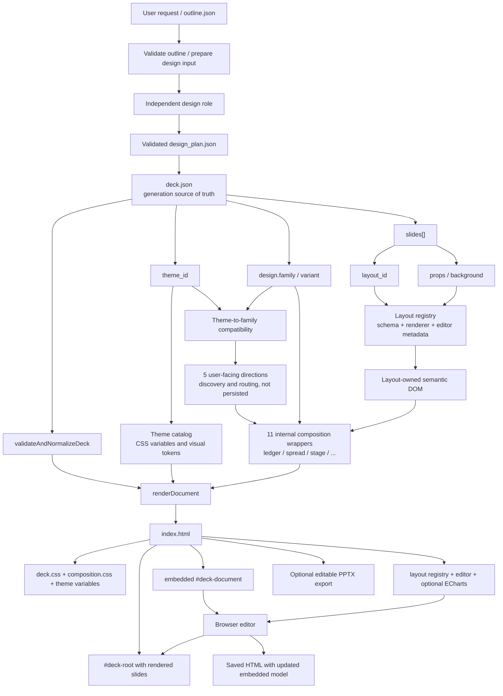

# Controlled HTML PPTX Architecture

## Independent design role and seed-free documents

`design_plan.js prepare` validates the outline and writes a designer-only input/catalog. The main agent receives paths and reuse status. An isolated role follows `references/design-role.md` and returns only visual choices. `design_plan.js accept` imports its completed Session Log response and generates metadata, page numbers and content bindings into `design_plan.json`. The brief contains compact indices with small linked details; no full catalog read is required. `inspect_deck_contract.js --design-plan` validates/scaffolds without silent aesthetic fallback; ordinary patches cannot overwrite visual enums. Facts, near-final copy, media acquisition and delivery remain main-agent responsibilities.

Base theme IDs or `theme-id@variant-id` select complete presets using existing resources. New `design.version=2` stores family/variant directly with no seed. Version-1 reads preserve a valid saved variant, falling back to legacy seed resolution only when needed. Pre-design documents retain their historical default appearance. Page-local variants/composition and all HTML editor controls remain available.

Matching input/catalog fingerprints allow plan reuse. Human HTML edits supersede the proposal and invalidate automatic reuse; saving never rolls them back. Plan-owned decks do not require another routine model reviewer and explicitly record that post-content model review was not performed. Program QA remains active. Unsupported model image inspection is non-blocking. Actual user constraints remain hard; outline visual hints do not override the designer or reset the retry budget. Source checks do not establish packaged OfficeV3 behavior; build/install/restart/live-task verification remain separate.


The controlled PPTX route compiles a structured `DeckDocument` into a
self-contained, editable HTML deck. The default artifact is `index.html`;
`deck.json` remains the reproducible generation model, and editable PPTX is an
optional export.

## Assembly model

`deck.json` is not a fifth visual layer. It is the document model that selects
and supplies the four layers used by the compiler:

1. `theme_id` selects color, typography, shape, surface, and decoration tokens.
2. `design.family + design.variant` select the page-level HTML composition.
3. `slides[].layout_id` selects a registered semantic layout and field contract.
4. `slides[].props` supplies text, media, tables, charts, and other content.



The layout renderer owns field meaning, capacity, DOM, and recoverable data.
The composition wrapper owns the larger reading path and page grammar. Theme
tokens style both layers without changing their semantic field contracts.
The five composition directions are only a user-choice and AI-routing view.
They translate eleven internal families into understandable options, while
`design.family` remains the single persisted runtime decision.

## Source-of-truth lifecycle

During generation:

```text
outline.json -> deck.json -> validate -> render -> index.html
```

For a short factual brief, the Skill prepends one durable research handoff:

```text
output/research/* -> research QA -> outline.json -> deck.json -> index.html
```

Presentation tools run from the artifact root, so their relative `research/`
directory is physically `output/research/` from the host workspace. A resumed
turn uses Session Log context and validates the durable research, outline, deck,
and QA files before deciding the next Skill step. It may reuse URLs from a valid
research handoff instead of researching again. A current 7/7 deck remains
complete and is not reopened. A failed outline report is repaired from the
report's exact issues, the current outline, and allowed research URLs; this is
Skill procedure, not an Agent runtime state machine.

The renderer embeds the normalized document as
`<script type="application/json" id="deck-document">`. The browser editor reads
that model, updates `props` or `layout_id`, and re-renders through the same
embedded layout registry.

After an in-HTML edit and save, the embedded `#deck-document` is authoritative
for that saved HTML artifact. The browser does not silently rewrite a sibling
`deck.json`, so the original reproducible input and the edited HTML may diverge.

## Current theme-to-composition rule

The runtime now uses a default family plus a compatibility allowlist.
`THEME_COMPOSITION_FAMILY` still supplies legacy defaults so existing output
does not change. A theme file may declare the complete policy directly:

```json
{
  "composition": {
    "default_family": "editorial-spread",
    "allowed_families": [
      "editorial-spread",
      "literary-minimal",
      "poster-asymmetric"
    ]
  }
}
```

Default mapping examples:

```text
studio             -> poster-asymmetric
blue-professional  -> institutional-grid
biennale-yellow    -> editorial-spread
retro-windows      -> retro-interface
```

The following describes internal capabilities and legacy CLI compatibility. Normal authoring selects a complete theme preset through the isolated role; the main agent does not select a direction, family or whole-deck variant.

The rules are:

- the default family preserves existing output when no explicit choice exists;
- users see `composition.directions` instead of needing to know eleven family ids;
- AI matches `directions[].families` ids to
  `composition.families[].selection_signals` to resolve one family;
- AI or user selection must stay inside `allowed_families`;
- `inspect_deck_contract.js --family <FAMILY_ID>` persists the selected family
  when scaffolding a new deck;
- a persisted compatible family survives validation, editing, reopening, and
  export;
- an unknown family is an error, while a legacy incompatible persisted value
  is normalized to the default;
- New documents persist `design.variant` directly without a seed; legacy documents retain their saved variant.

The current relationship is therefore:

```text
theme -> compatible families -> available directions -> theme preset -> saved family / variant
```

This provides more creative range without allowing arbitrary theme x family
combinations that have not been visually tested.

## Five user-facing composition directions

| Direction | Internal families | Typical user intent |
| --- | --- | --- |
| `structured-systems` | institutional / analytical / technical | business reporting, decisions, systems |
| `narrative-pages` | editorial / literary | research, long-form, continuous stories |
| `visual-impact` | poster / cinematic | brands, profiles, image-led narratives |
| `interface-modules` | product / retro | product features, digital experience, UI metaphors |
| `expressive-objects` | playful / brutalist | community, strong attitude, experimental expression |

Directions are not stored in `deck.json`. The theme filters incompatible
families first; a user choice or AI inference then selects one concrete family
from the intersection of that direction and the theme allowlist. Users face five
choices while the renderer still receives one precise family out of eleven.

## Eleven composition families

| Family | Reading path | Typical use |
| --- | --- | --- |
| `institutional-grid` | disciplined grid and information rails | enterprise, consulting, research |
| `editorial-spread` | magazine spreads and mixed text scales | trends, brand story, culture |
| `poster-asymmetric` | offset display type and strong anchors | launches, manifestos, creative pitches |
| `playful-collage` | collage, stagger, and light rhythm | education, events, community, consumer |
| `brutalist-frame` | hard frames and graphic blocks | portfolios and challenger brands |
| `retro-interface` | windows, terminals, and pixel panels | games, retro tech, experiments |
| `literary-minimal` | narrow measure, margin notes, whitespace | speeches, essays, long-form summaries |
| `product-showcase` | device stages, browser stories, feature flows | product launches, SaaS, demos, cases |
| `cinematic-canvas` | large imagery, film mattes, chapter cuts | pitch openings, brand films, profiles |
| `analytical-exhibit` | evidence rails, decision boards, exhibit grids | boards, analytics, strategy reviews |
| `technical-schematic` | blueprint grids, nodes, and spec sheets | architecture, engineering, science |

A theme may allow several families, but the cross-product is not arbitrary. A
deck selects one family while its 15 semantic `layout_id` values still define
page meaning and editability.

Variants may own small, variant-specific HTML anchors, but must not duplicate
layout-owned editable fields. Interface metaphors stay semantic: browser chrome
is limited to `browser-story` media pages, system buses to `annotated-system`,
and evidence scales to `evidence-rail`. Restrained information families also
suppress repeated pill/tape labels from Visual DNA, while expressive families
may keep them when those shapes are part of the intended visual language.

## Extension boundaries

Implementation and validation are deliberately separated:

| Change | Implement once | Validate across |
| --- | --- | --- |
| Theme | One theme record plus optional assets | Representative layouts and its compatible families |
| Layout | Schema, renderer, editor metadata, export mapping | Every registered composition family |
| Composition family | HTML wrapper, anchors, CSS, variants | Every registered layout |

The target is additive implementation with cross-product testing, not one
implementation per combination. With 33 layouts and 11 composition families,
the system should contain 26 primary implementations and 165 automated
compatibility checks, not 363 separate renderers.

## Key implementation files

- `scripts/deck_spec_core.js`: DeckDocument validation and normalization.
- `scripts/composition_core.js`: five directions, eleven families, allowlists, and persisted variants.
- `layouts/registry.js`: layout contracts and composition HTML wrappers.
- `scripts/finalize_controlled_deck.js`: one dependency-ordered spec/truth/media validation, HTML compilation, self-check, and runtime-probe pass that stops at the first actionable failure.
- `scripts/render_deck_html.js`: full HTML assembly.
- `runtime/deck-editor.js`: browser editing, re-rendering, and saving.
- `scripts/html_to_editable_pptx.js`: optional editable PPTX export.

The skill-level operational contract remains in
`box_agent/skills/document-skills/pptx/references/controlled-layouts.md`.
