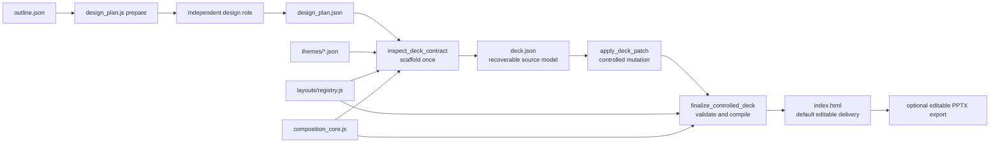

# Controlled HTML PPT Development and Extension Guide

## Independent design role and seed-free documents

`design_plan.js prepare` validates the outline and writes a designer-only input/catalog. The main agent receives paths and reuse status. An isolated role follows `references/design-role.md` and returns only visual choices. `design_plan.js accept` imports its completed Session Log response and generates metadata, page numbers and content bindings into `design_plan.json`. The brief contains compact indices with small linked details; no full catalog read is required. `inspect_deck_contract.js --design-plan` validates/scaffolds without silent aesthetic fallback; ordinary patches cannot overwrite visual enums. Facts, near-final copy, media acquisition and delivery remain main-agent responsibilities.

Base theme IDs or `theme-id@variant-id` select complete presets using existing resources. New `design.version=2` stores family/variant directly with no seed. Version-1 reads preserve a valid saved variant, falling back to legacy seed resolution only when needed. Pre-design documents retain their historical default appearance. Page-local variants/composition and all HTML editor controls remain available.

Matching input/catalog fingerprints allow plan reuse. Human HTML edits supersede the proposal and invalidate automatic reuse; saving never rolls them back. Plan-owned decks do not require another routine model reviewer and explicitly record that post-content model review was not performed. Program QA remains active. Unsupported model image inspection is non-blocking. Actual user constraints remain hard; outline visual hints do not override the designer or reset the retry budget. Source checks do not establish packaged OfficeV3 behavior; build/install/restart/live-task verification remain separate.


This guide is for maintainers of `box_agent/skills/document-skills/pptx/`.
It explains how to extend the controlled HTML PPT system without breaking its
editable, validated, and exportable contract. Read the product model in
[Controlled HTML PPTX Architecture](PPTX_CONTROLLED_HTML_ARCHITECTURE.md);
`box_agent/skills/document-skills/pptx/SKILL.md` remains the runtime instruction
contract for agents.

## 1. The one delivery path



`deck.json` is the generation source of truth. `index.html` is its deterministic
compiled artifact. After an editor save, the embedded `#deck-document` is the
source model for that saved HTML copy; it does not silently overwrite sibling
`deck.json`.

Keep responsibilities separate:

| Layer | Owns | Does not own |
| --- | --- | --- |
| `theme_id` | palette, typography, shapes, surfaces | business fields or page semantics |
| `design.family / variant` | deck-wide reading path and composition shell | duplicated layout fields |
| `layout_id` | page semantics, capacity, editable DOM | theme styling or cross-page grammar |
| `props` | the page's copy, media, chart, and table data | theme, layout, or family selection |

## 2. Change map

| Change | Primary files | Also verify |
| --- | --- | --- |
| Theme selection and compatibility | `themes/*.json`, `scripts/theme_selection_core.js` | composition allowlist and theme tests |
| Layout | `layouts/registry.js` | `runtime/deck.css`, editor metadata, export mapping, tests |
| Composition family | `scripts/composition_core.js`, `runtime/composition.css` | wrappers and every registered layout |
| Deck schema and normalization | `scripts/deck_spec_core.js` | contract inspector, spec validator, tests |
| Patch recovery | `scripts/apply_deck_patch.js` | matching field contract and regression tests |
| Truth rules | `scripts/validate_deck_truth.js` | outline guidance and truth tests |
| Compiler and final gate | `render_deck_html.js`, `finalize_controlled_deck.js` | self-check and runtime probe |
| Editor | `runtime/deck-editor.js` | registry embedding and saved HTML |
| Charts / PPTX export | `runtime/chart-runtime.js`, `html_to_editable_pptx.js` | ECharts and PptxGenJS mapping |

Do not hand-edit these generated artifacts:

- `layouts/manifest.json` — run `build_layout_manifest.js` after registry/theme changes.
- controlled-route `index.html` — render it from `deck.json`.
- a new deck's top-level `deck.json` — scaffold it once, then update content through
  `deck.patch.json` and `apply_deck_patch.js`.

## 3. Extension recipes

New designs use one palette contract for both input paths. User role colors are
locked; the designer supplies exact background/text/primary/accent/secondary
values and accent_usage even when retaining theme defaults (heading is optional).
The compiler records role provenance and freezes derived tokens under
`design_contract.palette.version=2`. Initial rendering, charts and editor rerenders
share those tokens. Partial user palettes are completed with sparse accents by
default; conflicting locked foreground/background colors are reported, not replaced.
Theme literals and mixes bind to the fixed palette. Browser QA checks component,
pseudo-element, gradient and shadow colors; palette mismatches block successful
finalization. Image pixels remain a separate concern. Legacy HTML/decks stay
readable; old design inputs need prepare to adopt the new contract without
overwriting saved human edits.

The five-topic regression checks require default bindings to reference actual layout
fields. Comparisons may omit supporting bullets rather than repeat a claim to meet
a minimum count. User palettes also own categorical fills and chart series; numeric
categories with different labeled units use independent axes. Runtime QA measures
image-wash contrast and effective diagram label size without requiring a vision model.
Findings remain delivery advisories.

Bundled Skills are runtime code, not writable task artifacts. File tools and the
permission engine reject bundled writes, including symlinks; Bash additionally checks
direct mutations and common inline-script writes. This command guard is not an OS
sandbox for arbitrary programs. Fixes belong in the development checkout and its
test/package workflow, never in a presentation task that patches its own validator.

### Add a theme

Copy the nearest `themes/*.json`, then define a unique id, selection metadata,
all visual tokens, and `composition.default_family` plus
`composition.allowed_families`. A theme is not a one-to-one layout clone: it may
allow several tested families, while one scaffolded deck persists exactly one
`design.family` and its named variant directly, without a seed.

Rebuild the manifest and test selection plus a representative gallery.

### Add a layout

Register it once in `layouts/registry.js`:

1. Declare identity, roles, density, content shape, media slots, capabilities,
   fields, and valid editor defaults.
2. Give every editable field a type, capacity, `required`, `editor`, and `role`.
   Add a field `description` whenever the name alone could mislead an authoring
   model.
3. Expose editable collections/enums in `editor.controls`.
4. Render every editable value through `editableText` or `editableTableCell` so
   its `data-prop-path` remains stable.
5. Add local CSS and, when applicable, a native editable PPTX mapping.
6. Rebuild the manifest; cover validation, rendering, editor behavior, and export.

Use semantic fields instead of expanding an unrelated field budget. For example,
`source` is a compact provenance caption; a page conclusion belongs in `insight`.
Recognizable historical misuse may be normalized in `apply_deck_patch.js`, with a
recorded `normalization_changes` entry and a regression test.

### Add a composition family

Register its family/variants and user-facing direction in `composition_core.js`,
allow it only from compatible themes, then add minimal structural anchors and
family-level CSS. A composition may change page grammar, but must never duplicate
layout-owned fields. Validate it across every registered layout; do not clone all
layouts per family.

## 4. Contract and repair boundaries

`deck_spec_core.js` is the final authority for field types, text/array budgets,
media paths, outline binding, and design compatibility. `apply_deck_patch.js`
may make deterministic, auditable repairs such as alias mapping, capacity
trimming, filling empty table cells with `—`, or moving a clearly misused
need-solution-value footer out of a short `source` caption.

It must not alter source facts, slide identity/order/layout, protected outline
titles, or invent facts. A repeated run of an unchanged failing patch is not a
repair and is intentionally caught by loop protection; change the named field or
add an appropriate normalizer instead.

## 5. Verification order

From the repository root:

```bash
node box_agent/skills/document-skills/pptx/scripts/build_layout_manifest.js --check
uv run pytest tests/test_pptx_controlled_deck.py -q
```

Then replay a real or minimal artifact:

```bash
cd "<artifact-output-dir>"
node /Users/malin1/Dev/ai/Box-Agent/box_agent/skills/document-skills/pptx/scripts/apply_deck_patch.js deck.json deck.patch.json
node /Users/malin1/Dev/ai/Box-Agent/box_agent/skills/document-skills/pptx/scripts/finalize_controlled_deck.js deck.json --out index.html
```

The finalizer refreshes the deck contract, spec, truth, image, HTML self-check,
and runtime-probe reports in dependency order. The deck contract depends on the
current `deck.json` and `outline.json`; changing either invalidates the old
receipt. After a focused repair, rerun the finalizer rather than using stale
individual QA reports. Visual/editor/export changes also need a manual
check for overflow, stable `data-prop-path` editing, chart playback, and
recoverable PPTX data.

## 6. Packaged officev3 verification

Source tests do not prove officev3 is using the changed skill. For a host-facing
change, rebuild/install the runtime, restart Electron, create one real deck, and
confirm the runtime version/skill digest in logs plus the resulting `deck.json`,
`qa/`, `index.html`, and one in-app HTML save.

```bash
cd /Users/malin1/Dev/ai/Box-Agent
uv run box-agent-build-runtime --version <version> --install-officev3

cd /Users/malin1/Dev/frontend/officev3
npm run electron-dev-debug-turbo
```

## 7. Before submitting

- Put the change in its proper layer; do not substitute a CSS override or prompt
  for a missing semantic contract.
- Never hand-edit generated manifest/HTML/scaffold structure.
- Give new fields defaults, capacity, editor metadata, renderer, CSS, and tests.
- Give new themes/families an explicit compatibility allowlist.
- Give every automatic repair a clear change record and regression test.
- Run manifest check, focused tests, and an artifact finalizer replay.
- If officev3 is affected, verify the packaged runtime rather than source alone.

## 8. Suggested reading order

1. This guide;
2. [Architecture](PPTX_CONTROLLED_HTML_ARCHITECTURE.md);
3. `references/controlled-layouts.md` for runtime constraints;
4. the target and adjacent layouts in `layouts/registry.js`;
5. matching tests in `tests/test_pptx_controlled_deck.py`;
6. only then the local renderer, validator, or exporter implementation.
