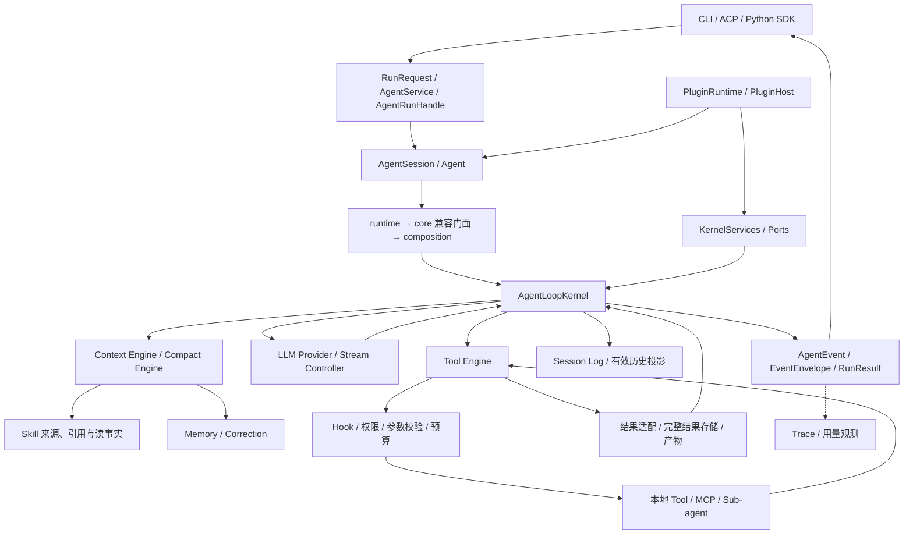

# Box-Agent Harness 设计梳理与优化评估

评估日期：2026-09-24。源码基线：`bf241c95fc8a0dc93771da99cb1ec846f2fb3a2e`。

本文面向负责 Agent 核心逻辑的维护者，覆盖从输入装配、模型执行、工具调用到恢复和交付的运行时模块。按职责划分模块，不逐一评审每个具体工具、Skill 脚本或宿主 UI。本文描述当前实现并提出设计建议，不改变现有公共契约，也不代表这些建议已经实现或通过运行验证。

## 1. 总体判断

**建议继续沿用当前分层架构，优先补强执行契约和可测量性，再逐步收缩主循环。** 当前已经具备请求级工具绑定、能力端口、运行级服务装配、可恢复会话日志、上下文投影和受限子任务。直接替换为另一套 Agent 框架，会增加现有 ACP、Skills、权限和恢复协议的迁移成本。

最值得保留的设计：

- `PreparedTools` 将模型看到的定义与执行对象、MCP generation 绑定，避免“看到的是旧工具，执行的是新工具”。
- Session Log 是会话事实来源；压缩改变有效上下文，不删除原始审计历史。恢复明确区分 `TOOL_NOT_STARTED` 与 `TOOL_OUTCOME_UNKNOWN`。
- Context、Skill、Tool 分工已经成形：来源与读事实、请求投影、执行权限分别有归属。
- PluginHost 显式装配并管理 scope，Kernel 消费已经解析的 Ports；CLI/ACP 共享执行实现。

优先处理的五项：

1. 将父子任务的委派预算从完成后累计改为执行前预留、执行中扣减的共享额度。
2. 定义运行结束与任务完成的区别，避免 `max_steps` 等终止被宿主误解为成功完成。
3. 为事件传输增加容量和慢消费者策略，同时保持只调用 `result()` 也能完成的 API 契约。
4. 将重复工具调用的合并限定在明确允许去重的工具，补充副作用与重试语义。
5. 建立任务级质量、成本、恢复与取消评估基线，再评估各类自动续跑和纠错策略的净收益。

这里的优先级表示建议开发顺序，不是安全漏洞等级。后文使用“已确认”表示可直接由当前源码判断，“待验证”表示需要故障注入、压测或真实模型评估。

## 2. 证据边界与现有设计入口

知识图谱与 meta 的基线均为 `699b67a2be71fe174f1bd090d48d0c4cf41b5bb3`，最后分析时间为 `2026-09-10T22:58:09.934Z`，433 个文件。当前 HEAD 后续修改包括 Kernel、运行 API、Context、Memory、MCP 和子任务，因此图谱仅用于定位。未发现本地 `last-run-summary.json`；本次未重新生成图谱。

现有设计应按以下顺序阅读，本文只补充全局评估：

1. [分层架构](../ARCHITECTURE_CN.md)：依赖方向和稳定内核边界。
2. [Agent Session](../AGENT_SESSION.md)：资源与生命周期。
3. [Tool / Skill 工作流](tool-skill-workflows.md)、[Tool Engine](tool-refactor/design.md)、[Skill / Context](skill-engine.md)：请求与执行职责。
4. [Session 与 Skill 所有权](../WORKFLOW_OWNERSHIP.md)、[上下文压缩](../CONTEXT_COMPRESSION_CN.md)、[HookBus](../HOOKBUS.md)。
5. [子 Agent 委派](../SUB_AGENT_DELEGATION_CN.md)、[ACP 集成](../INTEGRATION.md)、[产物协议](../ARTIFACT_PROTOCOL.md)。

本次以直接读取源码和现有测试为主，没有真实模型、MCP 服务或 officev3 运行证据。现有测试文件在本文中是回归入口，不能理解为本次已通过。

## 3. 当前架构与运行链路

Harness 指模型之外的执行系统：它决定模型可见信息、可用动作、执行时序、权限、预算、持久化、错误恢复和对宿主的输出。模型输出是行动提议；是否执行与如何提交由 harness 控制。



兼容入口仍允许直接使用 Agent；并非所有调用都必须经过新 Run API。图中的 Memory、Hook、日志等是多处使用的服务，不表示它们只在单一阶段运行。

一次运行的主要步骤：

1. Session 准备模型、权限、Tools、Skills、Memory 与 Prompt；按作用域持有资源。
2. `AgentService.start` 检查 Session 所有权，创建运行控制与 handle，并进入 Session 执行流。
3. 每个 step 处理取消、暂停、注入和预算，准备工具快照，进行历史估算、压缩与最终请求投影。
4. 请求上下文记录与 Skill 交付事实按提交边界处理，再调用 Provider；流控制区分活动通知与真实模型输出。
5. 若模型请求工具，Tool Engine 进行准入、参数处理、Hook、权限协商及调度。调用记录在开始执行前 flush；工具结果通过 Kernel 提交回调闭合消息。
6. 结果分别用于模型历史、宿主展示、完整文本读取及产物发现。下一 step 使用投影后的有效上下文。
7. 终止、等待用户、预算耗尽或取消时产生终止事件；Run handle 聚合结果，释放 Run 资源。Goal 续跑可能继续发起后续回合。

### 3.1 状态与生命周期

| 范围 | 当前主要所有者 | 必须保持的边界 |
| --- | --- | --- |
| Process / Application | PluginRuntime、部分共享客户端 | 不吸收某个 Session 的授权、cwd 或历史 |
| Session | AgentSession、Agent、Skill runtime、MCP 能力、Session Log | 每个 Session 同时只有一个有效运行所有者 |
| Run | KernelServices、RunControl、Tool Engine、HookBus | 预算、取消和事件序号不能泄漏到其他运行 |
| Request / Step | PreparedTools、PreparedContext、模型请求和工具批次 | 工具定义、引用版本和实际执行目标保持一致 |
| 跨 Session 经验 | Memory、Correction | 可检索经验不替代当前会话事实和权限 |
| 派生输出 | Trace、宿主 UI、产物元数据 | 不成为恢复会话的第二套权威状态 |

## 4. 业界设计：借鉴机制，而非照搬框架

以下为已查阅的一手资料。资料中的方法不构成 Box-Agent 已实现某项能力的证据；“应用建议”均为本文推导。

| 来源 | 可借鉴机制 | 对 Box-Agent 的应用建议 |
| --- | --- | --- |
| [Anthropic：长任务 harness](https://www.anthropic.com/engineering/effective-harnesses-for-long-running-agents) | 初始化环境、增量执行、明确验收项、跨上下文交接；单靠压缩不能保证完成 | Goal 的完成应关联可验证结果；领域验收和交接材料由 Skill/plugin 提供，Session Log 保存引用与执行事实 |
| [Anthropic：Context Engineering](https://www.anthropic.com/engineering/effective-context-engineering-for-ai-agents) | 按需获取信息、压缩、结构化笔记与有选择的子任务隔离 | 保留现有 Context 投影与结果外置，评估压缩后的约束保真和证据可恢复性 |
| [LangGraph：Persistence](https://docs.langchain.com/oss/python/langgraph/persistence) | 区分 thread 内 checkpoint 和跨 thread store | 保留 Session Log 与 Memory 的语义分离；可研究日志派生快照加速恢复，不引入第二套会话事实来源 |
| [MCP Tools 规范，2025-06-18 版本](https://modelcontextprotocol.io/specification/2025-06-18/server/tools) | 结构化工具定义、结果与列表更新；未知来源 annotations 不应直接作为可信依据 | 延续 generation 检查；副作用、并行和权限策略由本地可信配置确定，不能仅信任服务端标注。此处引用固定版本，不宣称是最新规范 |
| [Anthropic：工具设计](https://www.anthropic.com/engineering/writing-tools-for-agents) | 工具契约围绕任务设计，结果提供有效信息，并用任务评估改进工具描述 | 为 ToolResult 建立清晰的结果状态和恢复指引；对工具发现、输出裁剪进行独立 A/B 评估 |
| [Anthropic：Agent Evals](https://www.anthropic.com/engineering/demystifying-evals-for-ai-agents) | 区分执行轨迹与环境最终结果；结合程序、模型和人工评估 | 不以“回答自称完成”或工具调用数作为成功标准；建立固定任务集及独立结果校验 |

当前没有证据说明引入完整 DAG 框架、向量数据库或增加 Agent 数量会改善 Box-Agent；这些都应先由瓶颈和评估结果驱动。

## 5. 逐模块设计评语与优化建议

### 5.1 公共 Run API 与宿主适配

**证据：** [api/run.py](../../box_agent/api/run.py)、[agent_service.py](../../box_agent/agent_service.py)、[agent_run.py](../../box_agent/agent_run.py)、[events.py](../../box_agent/events.py)。

**现状与评语：** `RunRequest / ControlCommand / EventEnvelope / RunResult` 提供了良好的宿主无关契约；busy Session 检查和运行归属校验值得保留。已确认 `_collect` 仅将 cancelled、waiting_for_user、error 单独映射，其余 stop reason 默认映射为 `COMPLETED`，包括 `MAX_STEPS`、`MAX_TOKENS`、`INTERRUPTED`。这可以表示“执行结束”，却不足以表达“用户任务完成”。

**建议（P0）：** 保留既有 status 兼容性，新增明确的任务 outcome / completion evidence，区分运行终止、目标达成、预算中止和需要后续处理。宿主据 outcome 决定文案，避免只看 `COMPLETED`。再统一 CLI/ACP 的跨回合编排，协议渲染继续留在适配层。

**验收：** 对每个 StopReason 做映射测试；预算耗尽不展示目标达成；同样的事件与控制脚本在 SDK、CLI、ACP 中产生一致的任务状态。入口：`tests/test_run_api.py`、`tests/test_sdk.py`、`tests/test_acp.py`。

### 5.2 Session 与插件装配

**证据：** [agent_session.py](../../box_agent/agent_session.py)、[session_assembly.py](../../box_agent/session_assembly.py)、[composition.py](../../box_agent/composition.py)、[plugins/host.py](../../box_agent/plugins/host.py)。

**现状与评语：** Session 准备一次、Run 服务按次创建，借入资源与自有资源有区分；静态依赖验证比运行中隐式发现更可控。兼容 facade 与托管路径并存，增加生命周期推理成本，但不是删除旧 API 的理由。

**建议（P1）：** 明确每个资源的 creator、owner、borrower、close 时机；为主要 Ports 提供可复用契约测试。优先替换关键边界的 `Any` 与隐式字段访问，不以增加抽象数量作为目标。保留兼容入口，让其只转换参数并复用同一执行路径。

**验收：** Session 重用不重复连接；部分初始化失败后已创建资源被逆序清理；借入资源不被误关闭；Run 中断后可再次运行。入口：`tests/test_plugin_runtime_lifecycle.py`、`tests/test_session_plugins.py`、`tests/test_managed_kernel_services.py`。

### 5.3 Kernel 主循环

**证据：** [kernel/loop.py](../../box_agent/kernel/loop.py) 的 `_run_agent_loop_impl`、`AgentLoopKernel`；[kernel/ports.py](../../box_agent/kernel/ports.py)。

**现状与评语：** 主循环已经通过 Ports 调用能力，但仍直接承载计划启动/批准文案、Memory 匹配、签名图片 URL 恢复、空回答修复、截断恢复和续跑判定。文件位置的分层已建立，策略职责仍有继续收敛空间。函数长度本身不是正确性缺陷。

**建议（P1）：** 以“准备请求→接收响应→决定动作→提交结果→终止”划分明确阶段；Kernel 保留顺序、取消、持久化和调用闭合。计划策略归通用运行策略或 owning plugin；图片 URL 处理归结果/输出适配；Memory 具体策略归能力。优先使用已有 Ports/Hooks，只有现有契约确实无法表达时才添加端口。避免拆成相互修改同一状态的大量 helper。

**验收：** 提取前后使用同一确定性事件轨迹，比较事件次序、有效历史、持久化提交点与停止原因。入口：`tests/test_core.py`、`tests/test_kernel_compatibility.py`、`tests/test_architecture_boundaries.py`。

### 5.4 运行控制与事件传输

**证据：** [run_control.py](../../box_agent/run_control.py)、[agent_run.py](../../box_agent/agent_run.py) 的 `_event_queue`、`events`、`result`、`aclose`。

**现状与评语：** RunControl 的协作式暂停/恢复/取消以及 PermissionBroker 的 request_id 匹配清晰。已确认 handle 使用无上限 `asyncio.Queue`，生产者即使没有事件消费者也会继续放入事件；现有测试明确支持只等结果。内存占用幅度尚未压测。

**建议（P0）：** 区分必须保留的结果/权限/终止事件与可合并的流式增量/心跳；为传输层定义字节预算、增量合并与可选临时溢写。不能只加 `Queue(maxsize=N)`，否则只等 `result()` 的调用者可能永久阻塞。终止结果 Future 和取消通道不得依赖消费者及时排空队列。明确 pause 为 checkpoint 生效，不等于冻结正在执行的外部进程。

**验收：** 无消费者、慢消费者、消费者退出、等待权限中取消、暂停后取消；验证内存上界和终止结果可达性。入口：`tests/test_run_control.py`、`tests/test_run_api.py`。

### 5.5 LLM Provider 与流恢复

**证据：** [llm/base.py](../../box_agent/llm/base.py)、[llm/openai_client.py](../../box_agent/llm/openai_client.py)、[llm/anthropic_client.py](../../box_agent/llm/anthropic_client.py)、[kernel/stream_controller.py](../../box_agent/kernel/stream_controller.py)、[dsml_fallback.py](../../box_agent/dsml_fallback.py)。

**现状与评语：** 模型适配、usage、thinking、图片和格式兼容均有专门模块；stale 检测与活动事件能区分“宿主仍在等待”和“Provider 仍在产出”。重试、无输出恢复、截断恢复分属不同层，组合成本需要显式观察，不能据层数直接判定重复重试。

**建议（P1）：** 记录每次逻辑模型请求与 attempt 的关系、失败分类、可见输出范围和恢复原因；统一 run 剩余时间/费用的外层预算，保留 Provider 对单次请求超时的权威。使用结构化模型能力配置约束格式 fallback；不让未完成工具参数进入执行。

**验收：** 无首包、部分文本后断流、thinking 后断流、usage 缺失、畸形 tool JSON、取消与恢复同 tick；验证可见文本不重复、工具不误执行、成本完整累计。入口：`tests/test_stream_retry.py`、`tests/test_stream_recovery.py`、`tests/test_llm_timeout.py`。

### 5.6 Context Engine 与资源投影

**证据：** [context_input.py](../../box_agent/context_input.py) 的 `prepare_request`、[context_resources.py](../../box_agent/context_resources.py)、[skill_context.py](../../box_agent/skill_context.py)。

**现状与评语：** 区分 durable history、request-only 引用及一次性多模态内容，并接收完整 PreparedTools，是正确边界；Skill 交付确认延迟到请求提交后也是重要不变量。字符估算、图片 token、工具 schema、纠错和引用共同参与预算，值得提供统一解释视图。

**建议（P1）：** 输出请求预算账单：系统提示、历史、工具定义、Skill、Memory、图片、输出预留各占多少；将估算值与 Provider 实测值对齐，按模型校准。为裁剪记录原因、来源与再次读取方式。优化目标同时考虑任务成功率与缓存命中，不只追求 token 最小。

**验收：** 多个大 Skill、图片与工具 schema 共同接近边界时不超限；被裁剪证据可恢复；准备失败不确认交付；跨请求不误复用 transient 内容。入口：`tests/test_context_input.py`、`tests/test_skill_context_regressions.py`、`tests/test_context_resources.py`。

### 5.7 Compact Engine

**证据：** [kernel/compact_engine.py](../../box_agent/kernel/compact_engine.py)、[kernel/context_engine.py](../../box_agent/kernel/context_engine.py)、[kernel/loop.py](../../box_agent/kernel/loop.py) 的压缩提交过程。

**现状与评语：** 压缩计算与应用分离，具有 LLM summary、确定性 fallback、失败冷却及 runtime state 恢复；比“简单截断历史”完善。剩余关键问题是语义质量，不能由压缩后 token 数证明。

**建议（P1）：** 建立压缩保真评估，重点检查用户约束、已授权操作、未解决问题、证据引用、失败尝试和待执行事项；结构化事实与自由摘要分开。按信息收益先外置大结果、移除重复引用，再做有损摘要。摘要不得推导新授权或把未知结果改成成功。

**验收：** 压缩前后相同后续任务的结果与约束遵循情况；摘要失败可降级；在提交前后崩溃均恢复合法历史。入口：`tests/test_core.py`、`tests/test_session_log.py`、`tests/test_skill_reference_persistence.py`。

### 5.8 Tool Engine：准入、去重与调度

**证据：** [tools/engine/contracts.py](../../box_agent/tools/engine/contracts.py)、[engine.py](../../box_agent/tools/engine/engine.py)、[scheduler.py](../../box_agent/tools/engine/scheduler.py)、[tools/base.py](../../box_agent/tools/base.py)。

**现状与评语：** 请求快照、参数校验、权限续接和受限并发有统一执行入口。已确认 Engine 以工具名和参数 JSON 对同一批调用去重，未在该去重分支按副作用类型判断；这可减少模型重复动作，但对于允许重复的命令会改变调用语义。调度先执行 serial 列表再执行 parallel 列表，也不是严格保持模型原始列表的全局顺序。

**建议（P0/P1）：** 先定义工具 effect 契约，例如只读、幂等写、非幂等写、外部动作，并让去重成为可信工具显式选择。默认未知工具不去重、不自动重试。随后给 `parallel_safe` 补充资源冲突标识或独立批次契约；没有依赖声明时，明确模型必须分 step 表达依赖。避免一次引入完整 DAG 调度器。

**验收：** 两个同参读取允许合并；两次明确追加写按契约执行两次；失败重试不被误吞；同资源写串行；MCP generation 变更拒绝旧请求。入口：`tests/test_tool_engine_service.py`、`tests/test_tool_engine.py`、`tests/test_tool_engine_compatibility.py`。去重变化需同步调整现有重复调用测试。

### 5.9 权限、Hook 与执行隔离

**证据：** [tools/permissions.py](../../box_agent/tools/permissions.py)、[tools/engine/execution.py](../../box_agent/tools/engine/execution.py)、[hook_bus.py](../../box_agent/hook_bus.py)、[tools/safety.py](../../box_agent/tools/safety.py)。

**现状与评语：** 权限、批准和执行有共享路径；HookBus 有 owner、冻结、超时与 drain，Tool Engine 在变更后重新处理参数。现有 shell guard 自身明确说明不是 OS sandbox，不能将命令检查等同于进程隔离。

**建议（P1）：** 将“工具可见、动作允许、用户批准、进程可访问”作为独立维度测试。跨动作复用批准时，绑定规范化参数、资源范围、工具 generation 和运行作用域。优先审计 Hook 参数变更、symlink、子进程和未知 MCP 的边界；需要强隔离的部署使用宿主 sandbox/container 能力，并通过执行端口接入。此处没有认定已存在可利用的权限绕过。

**验收：** Hook 扩大范围后重新授权；旧批准不能控制新 Run；未知 annotations 不能授予写权限；权限等待可取消；清理失败不隐藏原始执行错误。入口：`tests/test_permission_negotiation.py`、`tests/test_hook_bus.py`、`tests/test_tool_engine_approval_lifetime.py`、`tests/test_safety.py`。

### 5.10 预算系统与 Sub-agent

**证据：** [tools/engine/budget.py](../../box_agent/tools/engine/budget.py) 的 `reserve / record_delegated_tool_budget`、[tools/sub_agent_tool.py](../../box_agent/tools/sub_agent_tool.py)、[tools/sub_agent_capabilities.py](../../box_agent/tools/sub_agent_capabilities.py)。

**现状与评语：** 子任务具有独立上下文、工具能力推导、写范围和自己的硬预算，且浏览器按 child key 隔离。已确认父层委派总量在子任务结果返回后累计；同批子任务在累计前均可通过父层门槛。假设父剩余额度 10、两个 child 各允许 10，现有机制不能保证合计不超过 10；单个 child 的硬上限与父层合计上限是不同契约。

**建议（P0）：** 引入父层额度预留：启动前分配 child lease，实际工具调用原子扣减，完成/取消后归还未使用额度；将部分失败、异常退出与重复结果的结算定义清楚。若未来跨进程，额度服务需要持久化或保守回收语义。先统一直接/委派工具额度，再将 summary、judge、memory extraction 的 token 与时间纳入观测和预算，避免一次扩大实现范围。

**验收：** 额度 10、并行两个 child 时累计执行最多 10 次；子任务崩溃不重复退还；父取消传播并关闭 child 资源；子任务不能扩大父授权。入口：`tests/test_sub_agent_tool.py`、`tests/test_sub_agent_capabilities.py`、`tests/test_tool_engine_service.py`。

### 5.11 Session Log、恢复与提交语义

**证据：** [session_log.py](../../box_agent/session_log.py)、[session_projection.py](../../box_agent/session_projection.py)、[kernel/tool_messages.py](../../box_agent/kernel/tool_messages.py)。

**现状与评语：** append-only JSONL、单 writer、序号验证、尾部修复、flush/fsync 与中断修复构成扎实基础。调用在执行前 flush；工具结果通过 `commit_result` 追加，但该方法本身不逐结果 fsync，不能将“已 append”都称为“已持久化”。并行结果还经过批次归并。恢复为 unknown 是保守且正确的选择，但未知窗口仍有优化价值。

**建议（P1）：** 写清提交矩阵：模型请求、工具意图、外部副作用、结果、终止各在哪个点 durable。为高风险外部动作提供幂等键/操作回执和状态查询；逐完成记录结果与 group commit 要权衡 fsync 成本。外部系统不支持幂等或查询时保留 unknown，不能声称 exactly-once。长会话先测恢复耗时，再考虑以日志 seq/hash 校验的派生快照。

**验收：** 每个提交边界注入进程退出；已发生副作用但结果未落盘时不自动重做；损坏中间记录拒绝恢复，半截尾行按契约修复。入口：`tests/test_session_log.py`、`tests/test_tool_result_commit.py`、`tests/test_agent_session_persistence.py`。

### 5.12 工具结果、资源引用与产物交付

**证据：** [tools/base.py](../../box_agent/tools/base.py) 的 `ToolResult`、[tool_result_storage.py](../../box_agent/tool_result_storage.py)、[tools/engine/results.py](../../box_agent/tools/engine/results.py)、[artifact_publication.py](../../box_agent/artifact_publication.py)。

**现状与评语：** 模型摘要、宿主内容、完整文本、结构化结果和 transient followup 分离，避免所有结果直接灌入历史。产物还有发现与交付策略，而不只是文件路径。多个结果字段容易出现“宿主看到成功、模型拿到裁剪内容、完整证据已失效”的一致性问题，当前未实测发生率。

**建议（P1）：** 提供统一结果描述：来源 call_id、状态、摘要、完整内容引用、hash、大小、裁剪标记和有效期；保持现有字段兼容。产物明确区分 discovered、validated、published，具体格式验证仍归 Skill/Tool。未知结果不能通过 UI 文案变成成功。

**验收：** 大文本分页可还原；完整结果缺失时明确报错；Hook 改展示不污染事实；文件重命名/拷贝后的交付元数据仍一致。入口：`tests/test_tool_result_storage.py`、`tests/test_tool_result_pipeline.py`、`tests/test_artifact_publication.py`。

### 5.13 MCP、工具发现与浏览器资源

**证据：** [tools/mcp_loader.py](../../box_agent/tools/mcp_loader.py)、[tools/mcp_tool_search.py](../../box_agent/tools/mcp_tool_search.py)、[tools/playwright_session_pool.py](../../box_agent/tools/playwright_session_pool.py)。

**现状与评语：** deferred discovery、generation、执行 timeout、错误封装及浏览器 Session pool 已处理不少生产问题。loader 同时覆盖传输、配置、managed server 和特定结果兼容，变更影响面较大；存在进程级默认 timeout/isolation 配置，其跨 Session 影响需要验证。

**建议（P1/P2）：** 先补契约测试，再按连接生命周期、catalog、调用适配、managed browser 拆职责；将配置尽可能变为会话快照。远程写调用超时应进入 outcome unknown，而非笼统归为“可重试错误”。记录 server generation、重连和 catalog 版本以支持诊断。

**验收：** 两个 Session 配置不串扰；工具列表变化与旧请求并发时正确拒绝；断连不盲重放非幂等动作；child 浏览器独立关闭。入口：`tests/test_mcp.py`、`tests/test_mcp_tool_search.py`、`tests/test_playwright_session_pool.py`。

### 5.14 Skill 生命周期与领域工作流

**证据：** [skill_runtime.py](../../box_agent/skill_runtime.py)、[skill_context.py](../../box_agent/skill_context.py)、[skill_restore.py](../../box_agent/skill_restore.py)、[tools/skill_loader.py](../../box_agent/tools/skill_loader.py)。

**现状与评语：** 来源快照、选择、读取事实和 Context 交付分开，支持按需引用与恢复，符合渐进加载思路。多份兼容信息和恢复路径增加理解难度，但不能将 Skill 文本“出现过”简单等同于当前请求已覆盖。

**建议（P1）：** 用少量明确状态描述 discovered / selected / source-resolved / delivered / read，区分身份 hash 与交付区间。恢复来源缺失、变更或超预算时提供结构化诊断。验收、工作目录和领域状态机归 Skill/plugin，Kernel 不识别 PPTX 等具体格式规则。

**验收：** 大 Skill 部分读取、hash 变化、引用文件缺失、压缩后重投影、child 继承均可追踪且不扩大授权。入口：`tests/test_skill_runtime.py`、`tests/test_skill_reference_persistence.py`、`tests/test_skill_plugin_composition.py`。

### 5.15 Memory 与已验证纠错

**证据：** [memory.py](../../box_agent/memory.py)、[memory_maintainer.py](../../box_agent/memory_maintainer.py)、[correction.py](../../box_agent/correction.py)。

**现状与评语：** 核心记忆、按需经验、自动提取、promotion 与带 subject/version 的 correction 分层优于无来源的长期摘要。已有来源、置信度、命中和版本信息应继续使用。检索质量、错误经验强化和多任务污染需要通过样本评估，而不是仅看写入成功。

**建议（P1/P2）：** 纠错经验必须绑定失败与验证回执，版本变化使经验降权或失效；增加冲突、过期和用户撤销路径的评估。对中文和中英混合查询建立召回集，先测现有检索再决定是否引入 embedding。后台提取纳入生命周期和用量观测；Memory 不恢复 pending call 或覆盖当前权限。

**验收：** 无验证成功证据不产生强纠错规则；版本改变后不过度注入旧规则；不相关经验不污染新任务；禁用配置确实阻止读写。入口：`tests/test_memory.py`、`tests/test_verified_corrections.py`。

### 5.16 Goal、计划、续跑与完成判定

**证据：** [goal_runtime.py](../../box_agent/goal_runtime.py)、[turn_continuation.py](../../box_agent/turn_continuation.py)、[turn_runtime.py](../../box_agent/turn_runtime.py)、[tools/plan_tool.py](../../box_agent/tools/plan_tool.py)。

**现状与评语：** Goal 控制有轮数/时间/无进展保护；continuation judge 使用隔离 transcript、不给工具、可被新用户输入中断。judge 的 Provider/client timeout 已有明确权威，应保持。CLI/ACP 仍拥有外层回合执行，不能说所有续跑编排都已经统一。

**建议（P1）：** 将通用续跑编排逐步集中到共享 Session/Service；区分“建议继续”和“允许继续”。硬预算、用户暂停和权限等待优先于模型判定；领域完成证据由 Skill/plugin 提供。评估误停、无益续跑与真实完成率，同时核算 judge 延迟和费用。不能简单再加一层更短 timeout 来掩盖慢响应。

**验收：** 模型自称完成但验收失败；judge 无效响应；新输入在 judge 返回同 tick 抵达；续跑达预算；等待用户不自动循环。入口：`tests/test_turn_continuation.py`、`tests/test_goal_runtime.py`、`tests/test_waiting_for_user.py`。

### 5.17 观测、用量与评估

**证据：** [session_trace.py](../../box_agent/session_trace.py)、[run_observer.py](../../box_agent/run_observer.py)、[llm/token_meter.py](../../box_agent/llm/token_meter.py)、[tests/acp_host/README.md](../../tests/acp_host/README.md)。

**现状与评语：** Trace 与 Session Log 分离，有脱敏、保留期和大小管理；用量跨辅助调用已有基础。RunResult 当前只汇总部分 usage 字段，需要核对与 observer/meter 的完整口径。大量单元和协议测试存在，但不能替代任务结果评估；本次未审计所有外部评估系统。

**建议（P0）：** 固定 run/turn/step/request/attempt/tool_call/parent_call 的关联关系；统一主模型、摘要、judge、Memory、child 的用量口径。把真实失败样本脱敏后转成离线回放和任务级评估，用程序校验最终环境结果，模型评审只用于无法完全程序化的部分。Trace 故障保持非致命，Session Log 故障保持执行失败。

**验收：** 同一调用只记一次 usage；重试成本可见；关闭 Trace 不改变任务；凭证和图片原始数据不进入诊断文件。入口：`tests/test_session_trace.py`、`tests/test_run_observer.py`、`tests/test_token_meter.py`。

### 5.18 配置、身份与运行时交付

**证据：** [config.py](../../box_agent/config.py)、[execution_profile.py](../../box_agent/execution_profile.py)、[auth.py](../../box_agent/auth.py)、[acp/runtime_entry.py](../../box_agent/acp/runtime_entry.py)、[build_runtime_cli.py](../../box_agent/build_runtime_cli.py)。

**现状与评语：** 类型化配置、共享执行 profile、认证刷新和独立 runtime 入口已经具备；身份与 Provider 通信分工比把凭证放进 Prompt 更合理。配置来自默认值、用户配置、宿主绑定及 Run 覆盖，理解最终行为需要知道生效值与来源。本次没有审计所有认证和打包实现，不对其完整安全性或部署正确性作结论。

**建议（P1/P2）：** 生成脱敏后的 effective configuration 诊断，注明每个关键预算、模型路由、权限和超时的来源及作用域；记录配置/schema/runtime 版本，使一次任务可复现。凭证刷新继续归认证模块；宿主运行策略不能扩大底层授权。为 runtime 包建立版本、资源清单和启动探测的一致性门禁。

**验收：** 同一配置在 CLI/ACP 的共享策略一致；缺失登录与可重试网络失败区分；刷新并发不造成重复风暴；打包安装后从实际宿主入口探测，协议 stdout 无日志污染。入口：`tests/test_agent_run_options.py`、`tests/test_auth.py`、`tests/test_runtime_entry.py`、`tests/test_version.py`。

## 6. 建议目标契约与改造顺序

### 6.1 四个需要固定的不变量

1. **事实先于完成声明：** 模型文本、运行结束、验收通过是三种不同事实，公共结果可以独立表达。
2. **执行前已获准且有预算：** request-bound target、规范化参数、授权范围与预算 reservation 必须覆盖实际执行。
3. **副作用未知不等于未发生：** 超时/取消只表示等待或运行停止，不保证外部动作已撤销；恢复先查询或人工核实，再决定重试。
4. **可恢复事实只写一处：** Session Log 保存会话事实；Context、快照、UI 和 Trace 都是投影或派生物，Memory 是独立的跨会话经验。

### 6.2 分阶段路线

以下是建议工作包，不是工期承诺。每个包保持独立可审阅，可按生产事故证据调整优先级。

| 顺序 | 工作包 | 主要归属 | 完成条件与兼容策略 |
| --- | --- | --- | --- |
| P0-1 | 基线、失败分类、结果 outcome | API / Observer / tests | 先固定现有轨迹；新增字段保持旧客户端可读；任务成功与运行终止分离 |
| P0-2 | 父子任务共享预算 | Tool Engine / Sub-agent | 并发不超额、取消不泄漏、结算幂等；保留原配置入口并澄清总量语义 |
| P0-3 | 事件容量与消费者生命周期 | Run handle / SDK | 无消费者能完成，慢消费者有界，取消不受背压阻塞；保持单消费者契约 |
| P0-4 | 去重、副作用与重试契约 | Tool base / Tool Engine / MCP | 未知动作不隐式合并；已有工具逐个声明；同步更新回归与迁移说明 |
| P1-1 | 主循环职责收敛 | Kernel / owning capabilities | 每次只移出一种策略，轨迹与提交点兼容；不改产品行为 |
| P1-2 | 请求预算账单与压缩保真 | Context / Compact / Providers | 超限率、约束保真、缓存与质量可比较；按模型灰度参数 |
| P1-3 | 提交矩阵与恢复故障注入 | Session Log / Tool Engine | 中断结果状态明确，幂等工具不重复副作用；新增日志事件兼容旧版本读取规则 |
| P1-4 | 跨宿主续跑和权限一致性 | Session / Service / adapters | 同一脚本在 CLI/ACP/SDK 中一致；保留宿主渲染与 Provider timeout 权威 |
| P2 | MCP 职责拆分、记忆检索、日志快照 | 各能力模块 | 由测得瓶颈决定；不为架构整洁提前引入数据库或新框架 |

改造首先保持源码行为和现有公共路径，涉及新事件/状态时按 additive 方式演进。部署时针对执行策略或预算做可回退的配置选择；不要通过回滚读取器跳过未知必需日志事件。

## 7. 衡量优化是否有效

建议先收集本项目基线，再设阈值。以下是指标定义，不是已测得结果或行业标准。

| 维度 | 指标 / 评估方式 |
| --- | --- |
| 任务质量 | 独立 verifier 验证的完成率；违反用户约束率；过早结束率；多次重复运行的稳定性 |
| 成本 | 每个成功任务总 token、模型调用、工具调用、费用；分别展示 summary/judge/child 占比 |
| 延迟 | 首个有效输出、任务完成 P50/P95；取消至静止 P95；批准返回至恢复执行时间 |
| 长任务 | 压缩前后约束保真率、证据可读率；恢复成功率、恢复耗时、未知结果数量 |
| 控制与资源 | 无消费者/慢消费者峰值内存；并发预算超额数；取消后残留进程/连接数 |
| 可靠性 | 同一副作用重复执行数；损坏日志正确拒绝率；权限和工具 generation 回归 |

最小任务集建议覆盖：多文件代码修改、长资料研究、需要 Skill 的产物制作、长上下文恢复、并行子任务、权限等待、MCP 断连和用户中途变更要求。真实模型评估固定模型版本、任务输入、环境快照与预算，每个样本重复运行；比较质量、成本和延迟，而非单独追求调用次数减少。开发集与保留集分开，模型评分抽样与人工核对。

## 8. 本次验证与后续执行边界

已完成：检查当前 HEAD 与索引基线差异；直接核对上述关键路径、相关测试及现有设计；阅读一手行业资料；新增本文与设计入口链接。未修改应用代码、配置、生成索引或运行时产物。

尝试运行：

```text
.venv/Scripts/python.exe -m pytest tests/test_architecture_boundaries.py tests/test_run_api.py tests/test_run_control.py tests/test_session_log.py tests/test_tool_result_commit.py -q -p no:cacheprovider
```

结果：解释器报告 `No module named pytest`，测试未启动。当前 shell 未找到 `uv`；本次未安装依赖。后续开发环境准备好后，应优先执行上述检查及每个工作包对应的直接回归，再按影响范围扩大。本文不声明任何源码测试通过。

文档检查：本地 Markdown 文件链接、源码链接和列出的测试路径检查通过；`git diff --check` 通过。新增文档另行检查行尾空白与文件结束换行，因为默认 diff 不覆盖未跟踪文件。初始 `git status` 未显示改动，但提示 `.box-agent-scratch/` 目录无读取权限，不能据此宣称整个工作区均已完整检查。

运行时状态：仅完成设计文档和静态核对；未构建、安装、探测、重启宿主或验证新的真实任务。后续凡涉及 officev3 消费的行为，逐项报告 `source → tests → build → install → probe → restart → live task`，不得用源码测试代替宿主验证。
