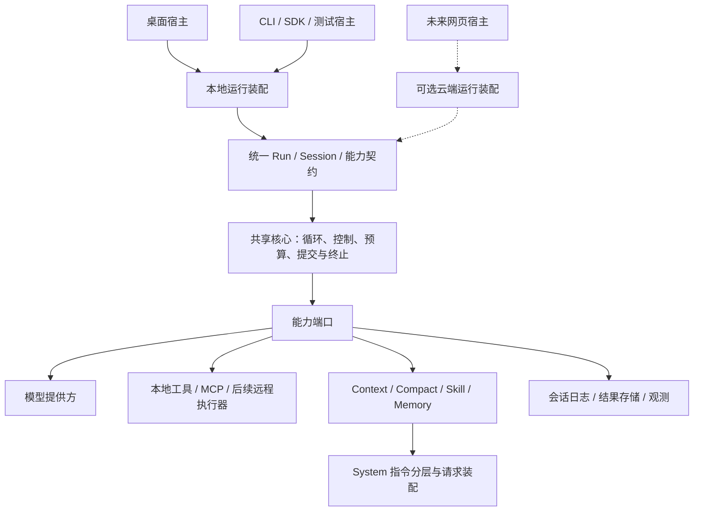

# Box-Agent 桌面与共享核心长期演进方案

日期：2026-09-28。实施状态基线：`6dafd19`（T12）。本文记录长期目标与阶段验收条件，不表示目标架构全部已经实现，也不承诺网页端或云端的上线时间。

阅读顺序：先读本文确定方向和边界，再读 [14 模块任务总览](ROADMAP.md)选择工作包，最后读具体 T 系列方案和验证记录。现有架构见 [分层架构](../../ARCHITECTURE_CN.md)，设计评估依据见 [harness 评估](../harness-review-cn.md)。

## 1. 长期目标与当前投入范围

形成可由不同宿主装配的共享 Agent 核心，让桌面、未来网页及其他宿主遵循相同的运行、权限、预算、恢复和结果契约。桌面继续具备完整的本地 Agent 执行能力，可以直接接入第三方模型；使用本地模型还是远程模型由提供方配置决定。

当前投入集中在桌面优化与共享核心建设。修改客户端后台时按这一边界组织模块；网页产品、云端执行服务、多语言执行协议和核心语言迁移，均在后续阶段满足进入条件后另立方案。

**当前最高优先级是直接改善 Agent 任务效果的 System Prompt 与 Tool 优化。** 先建立最小任务基线，随即迭代指令装配、工具定义、发现和结果反馈。纯架构整理、目录迁移、云端化和语言迁移排在这条主线之后；只有为质量优化所必需的边界收敛才随任务实施。权限、预算、数据完整性和取消的阻断性缺陷仍需及时修复。

固定原则：

- 桌面本地执行路径持续可用；不能将桌面改为依赖云端 Agent 服务的纯前端。本地执行不等于所有模型和工具都能离线使用。
- 共享核心复用一套运行语义。宿主负责协议、UI 和能力装配，不各自复制主循环、预算或通用续跑策略。
- 多端一致指核心契约和能力相同时的行为一致；设备工具、权限和模型不同，可以产生不同结果，应明确告知可用能力。它不等于模型文本逐字一致。
- Session Log 保持会话事实来源；UI、Trace、Context 投影和后续快照不形成第二份权威会话状态。Memory 是独立的跨会话经验。
- 稳定 Kernel 保留执行顺序、取消、预算和提交不变量；领域流程、格式规则及完成验收归所属 Tool、Skill 或插件。
- 核心语言选择由性能证据和迁移成本决定，不将“换语言”作为共享核心建成的前提。

## 2. 目标架构与职责

图表示目标依赖关系；虚线部分尚不实施。“共享”首先指同一实现和契约可在不同位置运行，并不要求所有桌面连接同一个服务进程。

| 层次 | 负责 | 与其他层的边界 |
| --- | --- | --- |
| 宿主适配 | UI、ACP/CLI 等协议映射、权限交互、用户输入和结果呈现 | 消费共享事件与结果，不决定核心预算或复制循环 |
| 运行装配 | 创建 Session、绑定 Provider 与能力、作用域和资源清理 | 显式区分自有与借入资源；不通过整份 Agent 隐式传递依赖 |
| 共享核心 | 请求→响应→动作→提交→终止；取消、运行归属、硬预算和调用闭合 | 不直接依赖 Electron、网页会话或产品格式规则 |
| 能力模块与插件 | 模型、工具、上下文、压缩、持久化、经验及领域策略 | 通过明确端口和生命周期接入；声明能力不等于获得权限 |
| 执行与存储设施 | 本地进程、远程执行器、文件或未来服务存储 | 将超时、取消和未知结果如实反馈，不把传输失败当成动作未执行 |

插件化按职责逐步推进，优先使用现有 Ports、Hook 和 PluginHost。不会为了统一名称，把所有模块立即改成动态加载插件或新增跨进程调用。

## 3. 状态与“无状态服务”的含义

Agent 的运行必然有状态。未来云端“无状态”指服务实例可替换、不会永久占有唯一会话事实；不要求每一步都清空对象，也不保证正在执行的工具能无缝转移。

| 状态范围 | 内容 | 演进约束 |
| --- | --- | --- |
| 进程／应用 | 插件注册、连接池、可重建缓存 | 不混入某个用户的授权、cwd 或历史 |
| Session | 模型及能力绑定、会话历史、工作区和授权作用域 | 每个会话一个有效运行所有者；跨端并发输入必须有顺序和冲突规则 |
| Run | 取消、权限等待、事件序号、预算、在途工具 | 当前按进程内契约管理；跨实例接管需另外设计租约、过期所有者隔离和恢复规则 |
| 请求／Step | PreparedTools、上下文投影、参数及模型响应 | 本次看到的能力必须与实际执行目标匹配；未完整的工具参数不执行 |
| 持久事实 | 工具意图、结果、终止与恢复记录 | 明确 append、flush、durable 的差别；派生快照需能按日志版本校验 |

云端阶段必须解决共享预算的原子扣减、权限请求归属、取消路由、断线重连以及事件恢复。当前单 Run 有界队列提供背压，不是持久消息总线，不能据此声称已支持断线续传。

本地执行与云端执行之间不能在未知结果时自动重放任务。若外部操作没有幂等键或状态查询能力，恢复应保留 outcome unknown；模型或客户端的重试不能保证 exactly-once。多设备会话同步、文件同步和运行迁移是不同问题，需独立确定产品需求。

## 4. 四阶段实施路径

### 当前最高优先级：System 与 Tool 运行效果

这里的 System 指模型实际接收的系统指令及请求级指令装配，不指操作系统；Tool 同时包含模型看到的能力定义、发现机制、参数和结果，以及真实执行契约。两者在桌面阶段立即推进，不等待共享核心完全拆出或网页产品启动。

**共同固定边界：** 桌面独立运行、第三方模型接入、后端权限与硬预算、会话事实来源、取消和 ACP 既有协议保持。提示词不能替代执行层授权，工具描述不能扩大实际能力；涉及公共工具改名、参数或结果结构的变化时，单项方案必须列明兼容、迁移与回退。

| 优先工作包 | 具体范围与产出 | 保持行为的收敛 | 功能变化与验收 |
| --- | --- | --- | --- |
| P0-Q0 最小任务基线与现状清单 | 盘点 System 来源、实际装配结果、工具目录与失败样本；固定任务、模型配置、环境与版本，建立独立结果校验 | 记录脱敏版本、来源、调用轨迹和成本，不修改发送内容或执行行为 | 先复现典型错误并取得对照结果；不先建设庞大评估平台，未有真实模型结果时明确留空 |
| P0-S1 System 分层与装配 | 区分核心规则、宿主能力、任务指令、Skill、Memory、运行反馈；定义来源、优先级、作用域、失效时机及稳定／动态部分 | 提取装配入口、记录来源和版本时保持最终消息内容与顺序 | 消除冗余／冲突、按实际能力注入、调整顺序或缓存边界属于功能变化；验证指令遵循、不虚构能力及压缩后关键约束保留 |
| P0-T1 工具能力、描述与参数 | 盘点重叠能力和接口粒度，优先改善高频误选工具的名称、用途、适用／不适用条件、参数 schema、示例与错误指引 | 建立清单与契约测试不改公开定义 | 描述措辞也影响模型决策；改名、拆并工具、参数变化逐项迁移。验证正确选工具、参数有效率及最终任务结果 |
| P0-S2 System 行为策略 | 优化计划、何时调用工具、失败后的动作、等待用户、续跑和完成判断；领域规则归所属 Skill／插件 | 固定策略入口和回归用例时保持原判断 | 改指令、增加／移除纠错提示属于功能变化；验证误停、无益续跑、重复失败及错误完成声明，不能用自称完成作为验收 |
| P0-T2 工具发现与暴露 | 常驻工具集、按任务暴露、搜索描述、激活和能力缺失反馈；核对模型可见定义与实际执行对象 | 保持请求快照与 generation 校验 | 工具集合或排序变化属于功能变化；验证发现成功率、发现轮数和上下文成本，避免为缩短请求而隐藏必需能力 |
| P0-T3 工具结果与反馈 | 结构化状态、有效摘要、错误分类与恢复指引、完整证据引用、裁剪和产物反馈 | 整理内部结果处理时保持模型和宿主内容 | 改返回内容属于功能变化；验证模型能采取正确下一步、证据可恢复、未知结果不误判成功，不按错误文本盲目重试副作用 |

**执行顺序：** P0-Q0 首先产出最小可复现基线，随后 P0-S1 与 P0-T1 按独立任务推进；根据失败归因选择 P0-S2、P0-T2 或 P0-T3。每次只改变一类因素并对照评估，避免同时改 System、工具描述和模型配置后无法判断收益。新增失败持续回填任务集；资源冲突等执行优化在证据指向它时作为专项工作包跟进。

**共同验收：**

- 主指标是独立校验的任务完成率和用户约束遵循。辅助指标包括工具误选、参数错误、发现轮数、失败后恢复、无益续跑、首个有效输出和总耗时、每个成功任务的总 token／成本；不单以提示词长度或调用次数减少判定成功。
- 任务集覆盖文件操作、资料检索、Skill 产物、长上下文、权限等待、失败恢复和明确的完成条件；保留开发样本与未用于调参的验收样本。
- 单项实验固定模型及可记录的提供方版本、配置、任务、能力和环境；重复运行并报告波动。验证当前主要模型及有代表性的第三方配置，未测组合明确列出，不宣称所有模型均改善。
- 在改动前定义每个任务的通过条件、重复次数、质量回退及成本／延迟容忍范围。程序校验优先，难以程序判定的质量采用盲审并抽样人工复核；不以模型对自己的评分代替结果证据。
- 确定性测试证明契约与装配正确，真实模型对照证明效果；两类证据分别报告。发现关键约束回退时修复或回退该工作包，保留可定位的 Prompt／工具定义版本，不混入其他优化后一起回滚。

### 阶段一：优先改善桌面任务效果并补齐运行契约

**目标：** 优先提高桌面 Agent 的任务完成质量和工具使用正确性，同时保持运行可控、可恢复、可测量，形成后续提取共享核心的稳定基线。

**工作：** 以本节 P0-Q0、P0-S1/S2、P0-T1/T2/T3 为最高优先级；在其基础上完善终止语义、消费者生命周期、事件容量、取消与权限、祖先共享预算、工具去重与副作用边界。质量评估随每项优化建立，不推迟至跨宿主阶段。

**已完成部分：** T1–T6 的共享运行边界，T7–T9e 的兼容及缺陷修复，T10/T11 桌面联调与兼容审查，T12 显式去重。System 专项及 Tool 使用质量优化尚未按上述新工作包实施；T12 不代表 Tool 优化完成。目标验收证据、完整 effect/重试契约及任务级评估基线仍待建设，不能将阶段一整体标记为完成。

**验收与进入下一阶段的条件：** 被提取职责的事件轨迹、权限、预算、取消及持久化提交点有可重复回归；失败与跳过有明确原因。先为选定职责建立基线即可逐项进入阶段二，不必等所有模块优化结束。正式发布另需实际 runtime 构建、安装、宿主重启与新任务验证。

### 阶段二：形成可独立组装的共享核心

**目标：** 桌面通过稳定装配入口使用共享核心，核心可在不加载桌面适配的情况下运行。

**工作：**

1. 明确资源 creator、owner、borrower、关闭时机，以及 Process／Session／Run／Request 的作用域。
2. 每次从 Kernel 移出一种能力策略，如结果适配、Memory 具体策略或计划领域逻辑；复用现有端口，保留循环不变量。
3. 收敛通用续跑与恢复的编排归属；宿主保留协议渲染和交互，Provider 保留单次请求 timeout 权威。
4. 建立模型、工具、上下文、存储、权限及观测的契约测试，兼容入口转换参数后复用同一路径。

**验收：** 相同确定性输入和能力下，重构前后事件顺序、有效历史、停止原因、预算和提交点一致；初始化中途失败能逆序清理，借入资源不误关闭，取消后 Session 可复用。桌面仍能直接接第三方模型，核心无需导入桌面适配。

**进入下一阶段的条件：** 一个轻量宿主可以通过公开装配契约执行真实循环，不需要复制策略或访问桌面私有字段。仅文件拆分或测试中绕过循环不算完成。

### 阶段三：验证跨宿主复用

**目标：** 在不建设网页产品的前提下，证明共享核心的契约能够被不同宿主正确使用。

**工作：** 使用 SDK、CLI、ACP 和轻量测试宿主运行同一组脚本，覆盖流式／仅结果消费、权限等待、取消、预算、恢复和错误；统一脱敏配置来源与用量口径。扩展阶段一已有任务集、环境快照和独立结果验证，比较跨宿主的质量、延迟与成本。

**验收：** 协议适配后得到等价的终止与工具执行事实；宿主差异能归因到显式能力或配置。确定性测试校验精确轨迹；真实模型任务用结果、约束遵循和统计指标评估，不要求文本一致。关闭非关键观测不改变执行结果。

**进入云端阶段的条件：** 产品确实需要云端执行，且已明确数据位置、可用能力、并发规模、可用性、延迟与成本目标。性能和可用性阈值在实施前由具体负载确定，不能事后按测试结果倒定指标。

### 阶段四：按产品排期扩展运行形态

**目标：** 保留桌面本地运行，同时支持按需增加云端执行、远程工具及多语言能力。

本阶段按独立项目决策，不要求云端化、多语言插件和语言迁移同时发生：

| 工作包 | 进入条件 | 必须证明 |
| --- | --- | --- |
| 网页／云端宿主 | 产品需求和阶段三基线明确 | 身份与租户隔离、会话归属、状态持久化、队列准入、全局限流、实例故障恢复、灰度与回退 |
| 远程端侧工具 | 云端运行确需使用设备能力 | 设备在线状态、权限绑定、调用身份、超时／取消／断线结果、产物传输；不会扩大端侧授权 |
| 多语言插件 | 有具体的外部语言能力需求，进程内接口不适用 | 版本化请求／结果、错误与取消语义、生命周期、数据大小上限、协议兼容及端到端开销 |
| 核心语言迁移 | 剖析证明 Python 核心确为瓶颈，且收益超过迁移成本 | 新旧实现通过同一契约与故障集；真实任务质量不回退；性能收益包含跨语言调用成本 |

高并发与高可用依赖准入、资源池、背压、隔离、恢复和外部服务容量，不能仅由更换语言获得。先测模型等待、工具耗时、CPU、内存及并发瓶颈，再决定局部加速或整体迁移；当前不预选语言、RPC 框架或数据库。

若出现多语言核心实现，共享的首先是版本化契约、测试向量和行为基线。新旧实现只在迁移期间有计划地并存，按宿主或会话灰度；外部副作用不得为比较实现而重复执行。日志与协议兼容必须明确版本和回退读取规则。

## 5. 与 14 模块和工作包的关系

14 模块是职责清单，四阶段是演进顺序，T 系列是可独立评审与回退的实施任务。三者不能互相替代。

| 阶段 | 重点模块 | 当前可执行方向 |
| --- | --- | --- |
| 一 | System 专项跨 2、5、6、13、14；Tool 专项跨 7、8、9、11、12，并关联 1、4、10 | 最优先执行 System／Tool 质量工作包；已有 T 系列作为运行契约基线 |
| 二 | 2、3，并贯穿 5、6、12、13、14 | 资源所有权、主循环单项策略提取、Ports 契约、通用编排 |
| 三 | 1、4、8、10、14，配合各能力模块 | 跨宿主等价性、配置及用量观测、任务质量与恢复评估 |
| 四 | 全部模块的宿主和执行设施扩展 | 由产品排期和测量证据启动，另立详细实现方案 |

当前首先投入阶段一的 System／Tool 质量主线。阶段二只随质量任务实施必要的边界收敛，独立的架构整理后置；阶段三契约测试可同步建立。具体顺序见 [ROADMAP](ROADMAP.md)，不等待全部架构改造完成才开始优化任务效果。

## 6. 每项实施的评审与交付门禁

实施前写明固定边界、保持行为的收敛、功能变化、兼容影响、验收和回退方式。保持行为的任务用确定性轨迹对照；功能任务增加直接回归与迁移说明；性能任务先保存可复现基线。偏离方案时在提交前同步修订。

每个任务独立提交方案、代码、测试和实际验证记录。只暂存相关路径，保留其他工作；未执行或未通过的检查不能记为通过。不因长期方向而自动启动云端开发、安装产品或发布。

交付状态分别记录：源码修改 → 源码测试 → runtime 构建 → 安装 → 启动探针 → 宿主重启 → 新真实任务验证。wheel/sdist 可构建不等于 standalone runtime 已安装；运行中的进程也不会自动加载新源码。

## 7. 本次文档落盘范围

本文及入口已落盘；本次补充 System／Tool 最高优先级主线、工作包与评估门禁，并同步调整 ROADMAP。现有 T1–T12 实现和长期产品边界保持，没有代码、配置、依赖或运行时变更。验证文档相对链接和差异格式，不重跑产品测试、模型评估或构建；回退本次文档提交即可撤销新增优先级说明。
