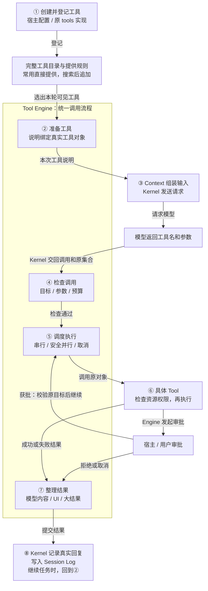
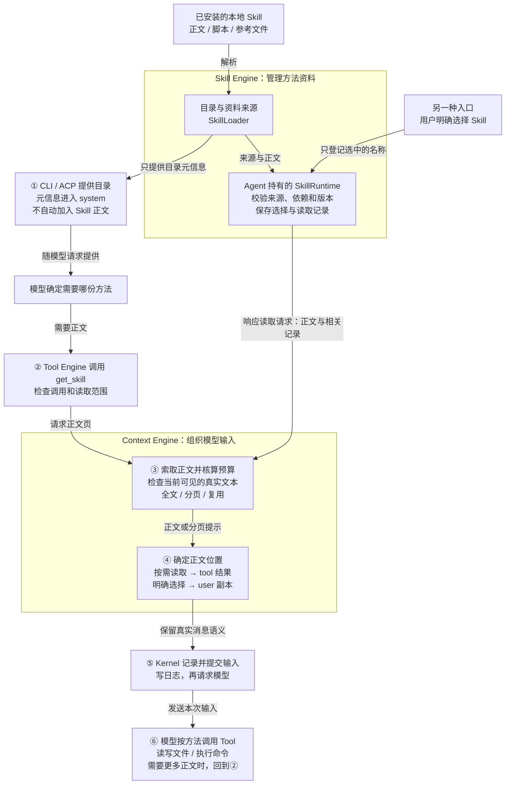

# Tool 与 Skill：组织结构和工作流程

本文用两张图说明**当前实现怎样工作**，源码基线为 `0e6a2d36f12d03a366f40807ca183800e3d3927c`。它包含已合并的 Tool 重构、PR114 的共享 AgentSession 以及适配后的 Skill 重构；后两项仍按整合分支说明，桌面运行时的更新状态需要单独验证。

先抓住两者的区别：**Tool Engine 组织程序动作的调用；Skill Engine 管理供模型参考的方法资料。** 模型阅读 Skill 后，仍要调用 Tool 才会读写文件、执行命令或访问外部服务。Context 负责组织主 Agent 的模型输入，Kernel 负责推进模型与工具之间的往返。

CLI / ACP 先准备具体 Tool 和 SkillLoader，再通过 [AgentSession.create](../../box_agent/agent_session.py) 创建 Agent。**AgentSession 持有配置和入口状态，Agent 持有具体工具及唯一的 SkillRuntime。** Session 不复制一套 Skill 读取或恢复记录；两张图从这层共同入口之后展开能力流程。

两张图采用相同读法：**大框表示职责归属，编号表示主要流程，箭头上的文字表示传递的内容或发生的动作。** 需要下一轮时，按末尾注明的编号重新开始。箭头不是逐个 Python 函数的调用图；关键调用位置在图后的表格中。为突出 Engine，普通回答直接结束的分支没有展开。

## 图一：Tool Engine——从可用工具到一次真实执行

原来的 `tools/` 继续保存具体工具。新增的 `tools/engine/` 是其中负责公共调用流程的部分，内部包括**准备工具、检查调用、调度执行、整理结果**。目录策略、工具搜索及具体动作实现仍在框外协作。

### 按一条调用读图

以 `read_file("orders.csv")` 为例：宿主先创建文件工具；工具准备阶段把 `read_file` 的说明与真实对象绑定。模型返回调用后，Engine 检查本次确实提供了这个工具，保存最终参数并安排执行。具体文件工具解析路径、检查该路径的访问权限，再读取文件。Engine 整理返回内容，Kernel 把真实 tool 回复记入历史，下一次模型请求便能看到文件内容。

若模型需要的工具暂时没有完整说明，它先调用 `tool_search`。搜索也经过同一条执行链；命中只会激活工具，**下一次模型请求**才收到新增说明，搜索本身不执行命中的工具。

| 图中部分 | 负责什么 | 当前代码位置 |
| --- | --- | --- |
| 创建与登记 | 宿主创建具体 Tool，注入工作区和权限等服务；通过 Session 创建入口交给 Agent 持有 | [setup.py](../../box_agent/tools/setup.py)、[agent_session.py](../../box_agent/agent_session.py)、[agent.py](../../box_agent/agent.py) |
| 目录、工具集合与搜索 | 根据配置、现有任务状态和已激活记录决定提供哪些说明；查找低频本地及 MCP 工具 | [local_tool_exposure.py](../../box_agent/tools/local_tool_exposure.py)、[mcp_tool_search.py](../../box_agent/tools/mcp_tool_search.py) |
| 准备工具 | 将模型看到的说明与真实对象、别名及 MCP 版本绑定；本次调用不能偷换对象 | [preparation.py](../../box_agent/tools/engine/preparation.py)、[contracts.py](../../box_agent/tools/engine/contracts.py) |
| 检查与调度 | 检查目标和最终参数、限制调用预算、调用 Hook；管理串并行、进度、权限继续与取消 | [engine.py](../../box_agent/tools/engine/engine.py)、[scheduler.py](../../box_agent/tools/engine/scheduler.py)、[execution.py](../../box_agent/tools/engine/execution.py) |
| 具体 Tool 与权限服务 | 解析真实路径或命令，判断资源访问权限并执行动作；`Tool.invoke` 同时提供参数 schema 校验 | [base.py](../../box_agent/tools/base.py)、[file_tools.py](../../box_agent/tools/file_tools.py)、[permissions.py](../../box_agent/tools/permissions.py) |
| 结果、输入与会话历史 | Engine 整理结果；Context 核算完整输入；Kernel 负责调用前日志、最终回复和下一轮执行 | [results.py](../../box_agent/tools/engine/results.py)、[context_input.py](../../box_agent/context_input.py)、[tool_messages.py](../../box_agent/kernel/tool_messages.py) |

### 这张图的四个重要边界

- **看到工具说明不等于取得权限。** 权限服务由具体 Tool 在知道真实资源后使用；需要用户批准时，Engine 组织协商和继续。批准后重新校验原目标，再经同一调度器调用，不重跑开始 Hook 或重复扣调用预算。授权范围及有效期以用户选择为准；工具可见或 Skill 加载不会扩大授权。
- **普通失败没有通用自动重试。** 参数错误或执行失败返回模型，由模型决定改参数、补条件或换动作。图中的自动继续只表示有界的权限协商；超时和取消不证明外部副作用没有发生，也不触发通用补偿。
- **Context 不负责选工具或执行工具。** 它消费 Engine 已经准备好的工具说明，计算输入开销，不改说明对应的真实目标。调用前的真实参数也由 Kernel 写日志；图的第 ⑧ 步专门表示结果提交。
- **默认装配尚未全部迁入 Plugin 工厂。** `ToolEnginePort` 支持插件提供实例；常规异步入口缺少该实例时，仍由 `AgentLoopKernel` 创建默认 Engine；同步辅助装配入口在 composition 中创建。具体工具仍按原集合登记。图没有把这项后续整理画成已完成。

## 图二：Skill Engine——从方法目录到模型按方法做事

Skill Engine 内部主要是两部分：**Loader 管目录和资料来源，Runtime 管会话中的选择、校验和读取记录。** 它不执行 Skill 中描述的业务步骤。主 Agent 的正文长度、分页、复用及消息位置，由框外的 Context Engine 处理。

### 沿两条入口读图

**模型自行采用方法。** 用户要求分析销售数据，模型先看到 Skill 的名称和简介，决定调用 `get_skill` 读取相关方法。Tool Engine 校验调用，Context 向 Skill Runtime 索取有效正文，核算预算并返回正文页。内容保留在真实 tool 结果中。随后模型才按照方法调用 `read_file`、`bash` 等工具；读取 Skill 本身不会运行它的脚本。

**用户明确指定方法。** 用户显式选择了一个 Skill，入口先把选择交给 Skill Runtime。主循环准备请求时，Context 取得正文，放入普通 user 消息的本次请求副本，不需要伪造 `get_skill` 调用。放不下时提供名称及分页提示，前提是本次确实提供了允许读取该方法的工具；否则在模型调用前明确失败，不静默丢掉选择。

| 图中部分 | 负责什么 | 当前代码位置 |
| --- | --- | --- |
| SkillLoader | 扫描已配置的本地目录，解析正文与元信息，处理来源、禁用和刷新；生成目录摘要 | [skill_loader.py](../../box_agent/tools/skill_loader.py) |
| SkillRuntime 及状态 | 由 Agent 持有；校验当前来源、required 依赖与正文版本；保存显式选择、交付范围和恢复记录 | [skill_runtime.py](../../box_agent/skill_runtime.py)、[skill_state.py](../../box_agent/skill_state.py)、[skill_dependencies.py](../../box_agent/skill_dependencies.py) |
| 入口与读取工具 | CLI/ACP 区分目录匹配和显式选择；`list_skills` 返回完整目录的分页结果，`get_skill` 返回指定方法，保留 `skill_view` 别名 | [cli.py](../../box_agent/cli.py)、[ACP](../../box_agent/acp/__init__.py)、[skill_catalog_tool.py](../../box_agent/tools/skill_catalog_tool.py)、[skill_tool.py](../../box_agent/tools/skill_tool.py) |
| Context Engine | 每次按真实消息、工具说明及输出预留计算预算，选择正文范围和消息位置；核实当前可见性 | [context_input.py](../../box_agent/context_input.py)、[skill_context.py](../../box_agent/skill_context.py) |
| Kernel 与 Session Log | 持久化真实消息及本次请求资料；宿主正文在请求日志提交后经通用回调确认；推进下一次模型请求 | [loop.py](../../box_agent/kernel/loop.py)、[session_log.py](../../box_agent/session_log.py) |

### 这张图的五个重要边界

- **目录和正文不是一回事。** system 中仍有名称和简介；取消的是固定名称或关键词命中后自动塞入正文。`list_skills` 可继续查完整本地目录，图中只展开 `get_skill` 的正文路径。Loader 扫描时仍会解析本地正文，因此“按需”指按需向模型交付，不能理解为磁盘正文从不预读。
- **依赖校验不等于自动执行或自动注入依赖全文。** 主路径校验 required 方法是否有效，并提供依赖信息；模型采用相关步骤前仍需读取依赖。Skill 不新增工具授权。
- **读过不等于现在还看得到。** Context 检查当前输入中的真实文本、来源、版本和范围。压缩移走正文后可重新读取；分页中版本变化需要从头读。待恢复资料在请求准备或提交失败后继续保留，直到完整交付或明确撤销。
- **日志确认不等于模型遵循了方法。** 宿主资料的通用提交回调经 Context 回报 Skill，Kernel 不直接解析 Skill 业务。真实 `get_skill` 沿既有 ToolResult 路径记录；两种读取不共用同一个提交回调。图省略了这些记录回写箭头。Skill Runtime 是 Agent 的会话内状态，Session Log 才是唯一持久会话来源。
- **两个组装例外仍存在。** 目录摘要由 Loader 与 CLI/ACP 组装；明确委派给子 Agent 的方法及必要依赖资料包，仍由 [sub_agent_tool.py](../../box_agent/tools/sub_agent_tool.py) 组装到子任务普通 user 消息。主 Agent 的两条正文入口由 Context 处理，这张图没有把子任务入口也画成已迁入 Context。

## 读完两张图应能分清的事

| 问题 | 当前负责方 |
| --- | --- |
| 有哪些程序动作、本次给模型哪些工具、一次调用怎样执行？ | tools 工具目录与策略 + Tool Engine + 具体 Tool |
| 有哪些方法、正文来自哪里、依赖是否有效、曾返回过哪些内容？ | Skill Engine |
| 下一次模型请求放什么资料、放多少、放在哪条消息？ | Context Engine；目录和子任务入口的现状例外见上文 |
| 方法中的下一步到底选哪个工具来做？ | 模型决定；Tool 与权限机制约束实际执行 |
| 什么时候请求模型、保存哪些真实消息、何时继续或结束？ | Kernel 与 Session Log |

更细的设计和兼容约束见 [Tool 设计](tool-refactor/design.md)与 [Skill 实现说明](skill-engine.md)。本次补充只解释现有组织和流程，没有新增调度器、注册体系或业务执行步骤。
